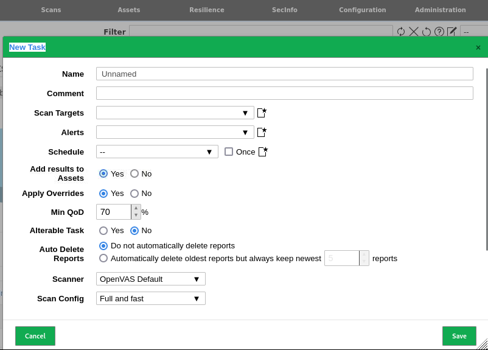
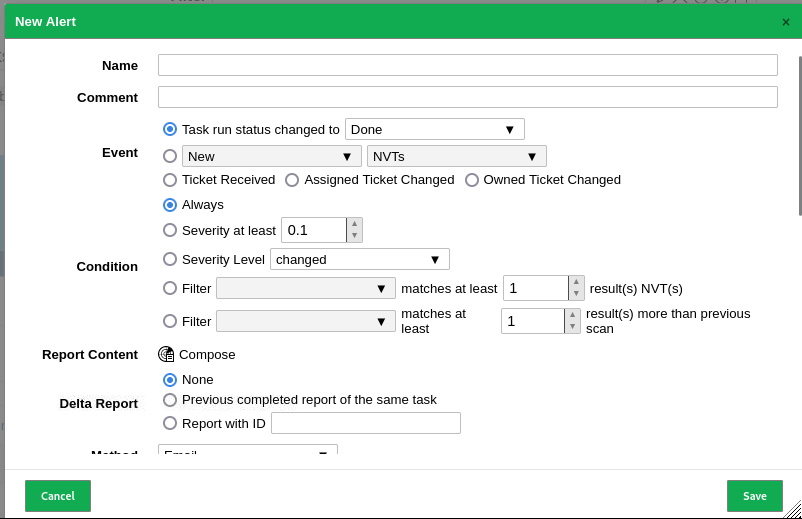
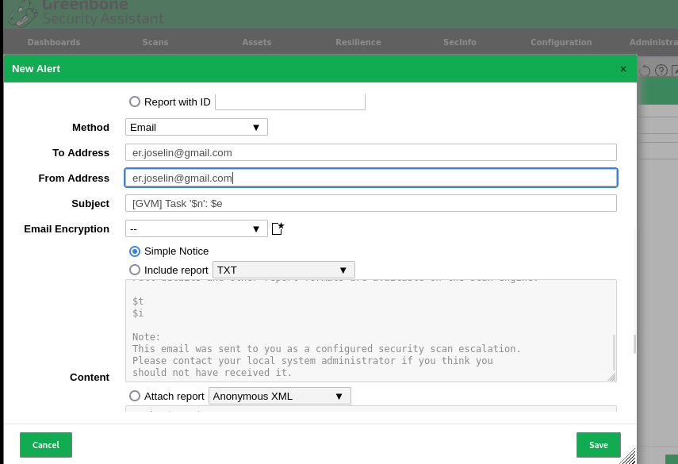
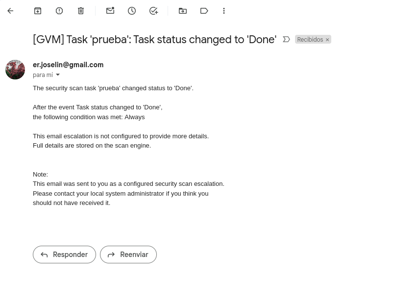

# Configuración del Servidor de Correos y Alertas

Para configurar un servidor de correos y alertas, sigue los siguientes pasos:

1. Configuración del Servidor de Correos
   - Sigue las instrucciones detalladas en el [repositorio](https://github.com/javierasping/Practica2_SAD/blob/main/Integridad%20de%20ficheros/Alertmail.md) para configurar el servidor de correos.

2. Crear una Task
   - Como vimos anteriormente.

3. Desplegar la Alerta
   - Selecciona la opción para desplegar una alerta.
  
   - 
   

4. Configurar la Alerta
   - Rellena los siguientes campos:
     - **Nombre de la Alerta**: Asigna un nombre descriptivo a la alerta.
     - **Nivel de peligrosidad**: Asigna a partir de qué nivel quieres que te manden la alerta.
     - **Dirección de Envío**: Especifica la dirección de correo a la que se enviarán las alertas.
     - **Dirección de Reenvío**: Configura una dirección de reenvío para las alertas.
     - Guarda la configuración.
    
     - 
     
     

5. Seleccionar la Alerta
   - Ve a la configuración de alertas y selecciona la alerta que acabas de configurar.
  
   - 
  

6. Disparar la Task
   - Inicia la tarea para que comience a monitorear y enviar alertas.

Es importante  ajustar adecuadamente el nivel de importancia de las alertas para evitar notificaciones innecesarias. Evita configurar alertas para eventos comunes, ya que esto podría llevar a ignorar alertas importantes. Asegúrate de que las alertas sean significativas y pertinentes para que puedas actuar de manera eficiente cuando se generen.

  

