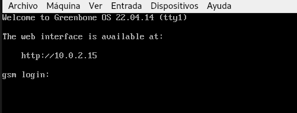
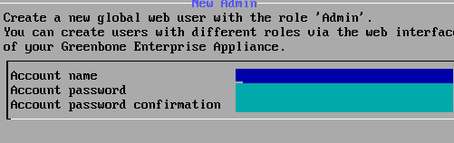
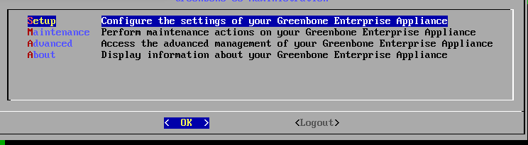
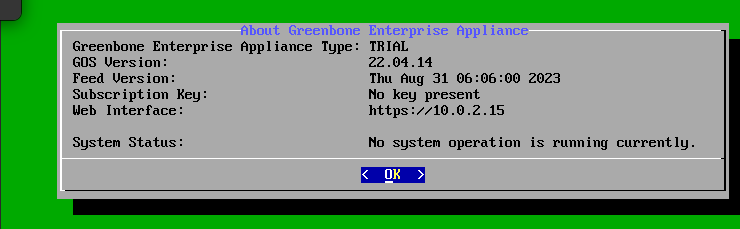
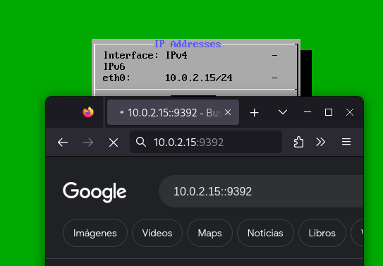
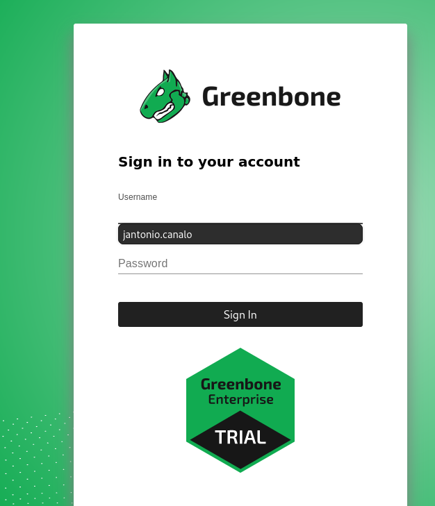

Después de esta breve introducción, nos disponemos a instalar OpenVAS. Tras muchas búsquedas y varios intentos fallidos, la mejor decisión, como suele ser fue la que parecía más obvia, que fue descargarla desde [https://openvas.org/](https://openvas.org/) para Virtualbox.

Una vez instalado, nos pide que introduzcamos el usuario. Introducimos el usuario ‘admin’, con clave ‘admin’.

En la siguiente pantalla, pulsa "Yes" para completar la instalación.

Creamos el usuario.

El siguiente menú nos informa que estamos en una versión de prueba.

El paso anterior nos llevará a la Interfaz, donde pulsando sobre "About" nos proporciona la IP que nos permitirá trabajar.

Con la IP en la barra de direcciones, ponemos nuestro usuario y nuestra contraseña, y ya empezamos a trabajar con ella.

