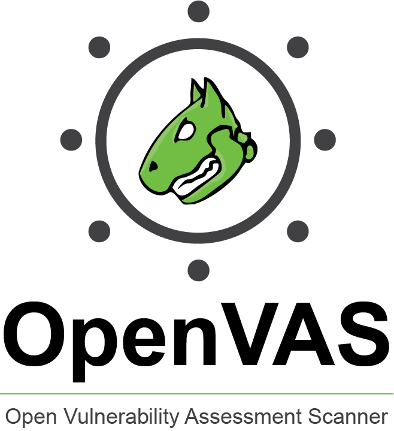

# Introducción a OpenVAS

OpenVAS es una potente herramienta de seguridad de código abierto utilizada para identificar y evaluar vulnerabilidades en sistemas y redes informáticas.
 En este contexto, es fundamental detectar posibles debilidades en la seguridad para proteger los sistemas y datos de posibles amenazas cibernéticas. 
 OpenVAS se basa en una tecnología llamada "Greenbone Security Feed" proporcionada por la empresa Greenbone Networks GmbH, especializada en soluciones 
 de seguridad de código abierto. Este conjunto de herramientas permite a los administradores de sistemas y profesionales de seguridad tomar medidas proactivas
  para mantener protegidos los activos digitales.

Después de esta breve introducción, nos disponemos a instalar OpenVAS. Tras muchas búsquedas y varios intentos fallidos,
 la mejor decisión, como suele ser fue la que parecía más obvia, que fue 
 descargarla desde [https://openvas.org/](https://openvas.org/) para Virtualbox.
