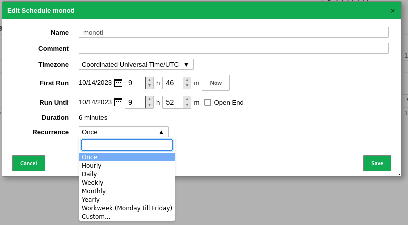
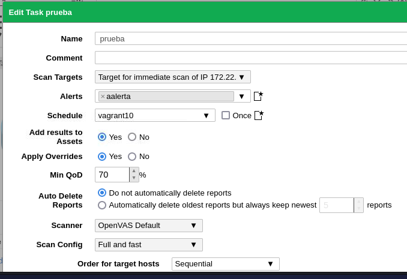
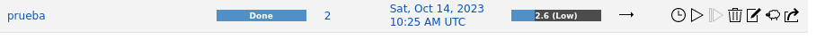

La monitorización continua implica escanear y evaluar constantemente sistemas y redes en busca de vulnerabilidades conocidas y desconocidas, configuraciones incorrectas y otros problemas de seguridad.

Tenemos dos opciones para configurar la monitorización continua:

1. **Configuración de Programación (Schedules)**: Esta opción te permite programar escaneos de seguridad de manera regular, lo que es útil para una monitorización continua y genérica.

2. **Creación de Tareas (Tasks)**: Utiliza esta opción para configurar escaneos de seguridad específicos y dirigidos a una tarea en particular.

En ambos casos:

1. **Nombre**: Asigna un nombre descriptivo a la configuración.
2. **Zona Horaria**: Selecciona tu zona horaria para programar los escaneos en función de la hora local.
3. **Inicio (First Run)**: Indica cuándo deseas que comiencen los escaneos.
4. **Duración**: Establece la duración prevista de los escaneos.
5. **Frecuencia**: Configura la frecuencia con la que se ejecutarán los escaneos.

Estos pasos son comunes tanto para la configuración de programación como para la creación de tareas específicas.

1. **Seleccionar el Nombre (1)**: Selecciona la tarea específica que has configurado al elegir el nombre que le has asignado.

2. **Disparar el Task (2)**: Inicia la tarea para que comience a ejecutarse según la programación y los parámetros que has definido.

