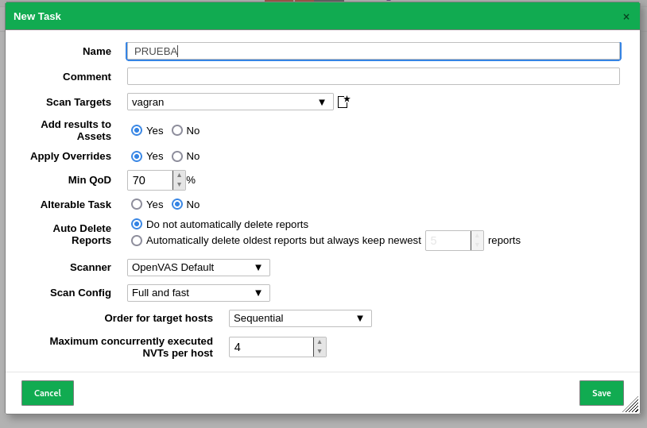

Ahora vamos a escanear un equipo para encontrar sus vulnerabilidades.
 En este caso, vamos a utilizar una máquina Metasploitable que hemos descargado de
 [https://github.com/rapid7/metasploitable3](https://github.com/rapid7/metasploitable3).

1. Abre la herramienta de escaneo de seguridad.
2. Ve a "Configuration" o "Configuración" en la interfaz.
3. Busca "Targets" en el menú de configuración.
4. Crea un nuevo objetivo, generalmente llamado "New Target."

"Ahora nos saldrá una pantalla con los siguientes datos."

5. Haz clic en el botón "Save" para guardar la configuración.

6. Luego, ve a la sección "Scan" en la aplicación.

7. En la sección "Task," haz clic en "New Task" para crear una nueva tarea de exploración.

8. Configura la tarea de exploración según tus necesidades. Esto puede incluir la selección de la configuración previamente guardada, la definición de los objetivos a escanear, la configuración de los puertos y las comprobaciones de autenticación, entre otros detalles.

9. Una vez que hayas configurado la tarea de exploración, asegúrate de guardar la tarea o iniciarla según sea necesario.

"Ahora nos saldrá una pantalla con los siguientes datos."

- **Name**: Nombre de la configuración
- **Comment**: Comentario o descripción de la configuración
- **Hosts**: Seleccionar hosts para escanear
  - **Manual**: Sí / No (Seleccionar hosts manualmente)
  - **From file**: Sí / No (Importar hosts desde un archivo)
- **Exclude Hosts**: Excluir hosts de la exploración
  - **Manual**: Sí / No (Excluir hosts manualmente)
  - **From file**: Sí / No (Importar lista de hosts a excluir desde un archivo)
- **Allow simultaneous scanning via multiple IPs**: Sí / No (Permitir exploración simultánea a través de múltiples direcciones IP)
- **Port List**: Lista de puertos a escanear
  - **All IANA assigned TCP**: Sí / No (Escanear todos los puertos TCP asignados por la IANA)
- **Alive Test**: Prueba de disponibilidad de hosts
- **Scan Config Default**: Configuración de escaneo predeterminada
- **Credentials for authenticated checks**: Credenciales para comprobaciones autenticadas
  - **SSH**: Sí / No (Configuración para comprobaciones autenticadas mediante SSH)
    - **-- on port**: Puerto para comprobaciones autenticadas SSH
  - **SMB**: Sí / No (Configuración para comprobaciones autenticadas mediante SMB)
  - **ESXi**: Sí / No (Configuración para comprobaciones autenticadas ESXi)
  - **SNMP**: Sí / No (Configuración para comprobaciones autenticadas SNMP)
- **Reverse Lookup Only**: Sí / No (Realizar búsqueda inversa únicamente)

10. Luego, espera los resultados de la exploración.

En el siguiente enlace podemos consultarlo [Análisis detallado informes obtenidos](https://github.com/javierasping/Practica2_SAD/blob/main/Escaneres%20de%20vulnerabilidades/An%C3%A1lisis%20detallado%20informes%20obtenidos.md) 

