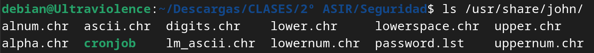
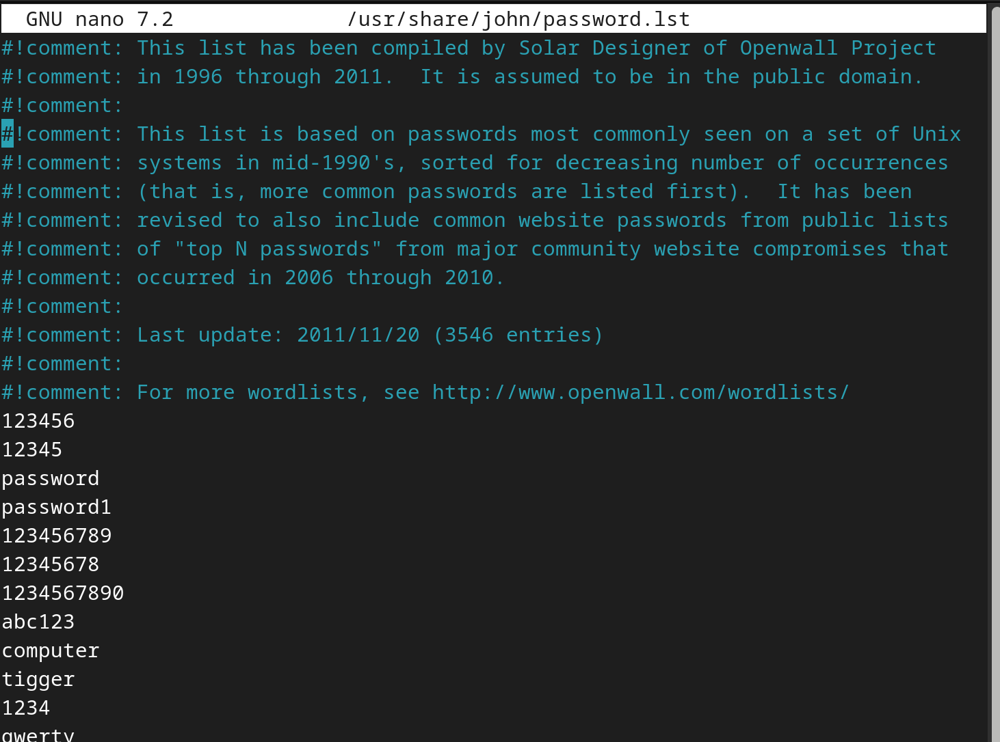

# Ataques de diccionario. Opciones.

Al obtener uno o varios diccionarios de contraseñas, la herramienta se encargará de evaluar exhaustivamente 
cada una de estas claves en un intento por descifrar el hash asociado a la contraseña.
El procedimiento implica la generación del hash para cada contraseña, seguido de la comparación
con el hash objetivo que buscamos romper. Si los hashes coinciden, hemos descifrado la contraseña,
de lo contrario, debemos continuar con la prueba.
Este proceso de descifrado puede llevarse a cabo de manera completamente automatizada para
todas las contraseñas presentes en los diccionarios de claves.

Un elemento notable es que la herramienta no se limita únicamente a probar las claves directamente
de los diccionarios sino que también incorpora números, letras mayúsculas, minúsculas y símbolos
a las palabras ingresadas. Además, tiene la capacidad de combinar palabras para explorar aún más
combinaciones de contraseñas y descubrir la clave utilizada.
John va a necesitar 2 archivos, el diccionario y el archivo con el hash que contiene los hashes.

## 1. Ataque Básico:

Opción: `--wordlist=rutadiccionario`

Ejemplo: `john --wordlist=/rutadiccionario.txt archivohash`

## 2. Incluir Reglas Adicionales:
   
Opción: `--rules`

Ejemplo: `john --wordlist=diccionario.txt --rules archivohasheado`

## 3. Fuerza Bruta con Caracteres Específicos (más en su sección):
Opción: `--incremental=modo`

Ejemplo: `john --incremental=ascii archivohasheado`

## 4. Ataque por Defecto (Wordlist + Reglas):
Opción: `--pot=archivo`

Ejemplo: `john --wordlist=diccionario.txt --rules --pot=hashes.pot archivohasheado`

## 5. Ataque a Contraseñas de Longitud Específica:
Opción: `--min-length=n --max-length=m`

Ejemplo: `john --wordlist=diccionario.txt --min-length=6 --max-length=8` archivohasheado

## 6. Uso de Formatos Específicos:
Opción: `--format=formato`

Ejemplo: `john --wordlist=diccionario.txt --format=md5 archivohasheado`

# Diccionarios que trae por defecto 

John The Ripper (por norma general aunque se puede especificar la ruta) guarda en /usr/share/john los diccionarios por defecto. En mi caso con la versión estandar en Debian al hacer un ls de esa ruta me devuelve este contenido:

Los archivos de caracteres (*.chr) son utilizados por John the Ripper para generar posibles contraseñas durante un ataque de fuerza bruta. Cada archivo representa un conjunto específico de caracteres que puede contener una contraseña.

El diccionario `password.lst` es un diccionario común que contiene palabras y contraseñas conocidas. Puedes usar este diccionario para realizar ataques de diccionario durante pruebas de seguridad.
