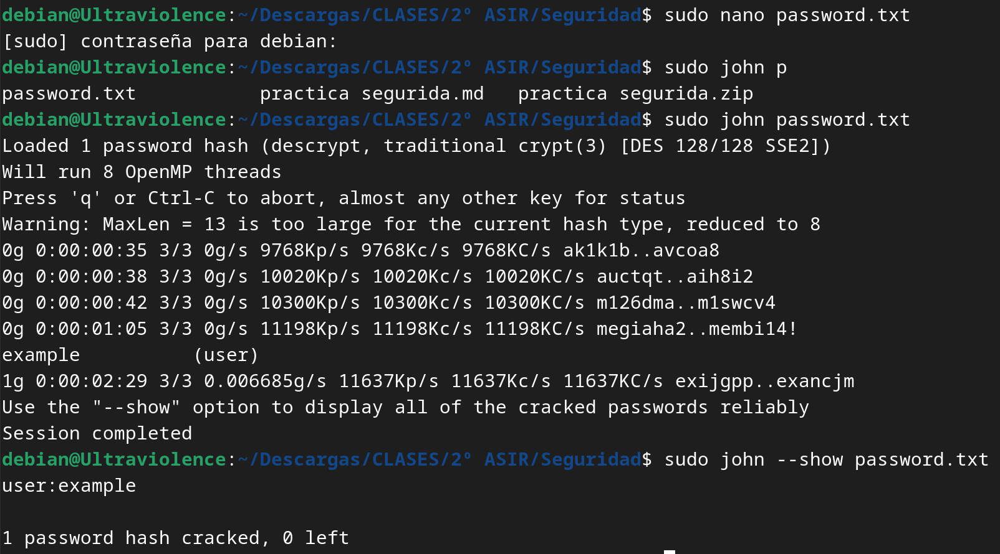

# Fuerza Bruta o modo incremental

El modo de fuerza bruta o incremental en John the Ripper consiste en probar todas las combinaciones posibles de contraseñas hasta encontrar la correcta. Este método puede ser efectivo, pero también es intensivo en recursos y lleva tiempo. Algunas de las opciones de john (base) son:

| Opción                   | Descripción                                                   |
|---------------------------|---------------------------------------------------------------|
| --incremental[=MODE]      | Modo "incremental" para fuerza bruta. Eespecificar el modo (por ejemplo, `--incremental=Digits` para dígitos). |
| --external=MODE           | Modo externo o filtro de palabras para fuerza bruta.          |
| --stdout[=LENGTH]         | Solo mostrar contraseñas candidatas [cortar en LENGTH].        |
| --save-memory=LEVEL       | Habilitar ahorro de memoria, niveles 1..3.                    |
| --node=MIN[-MAX]/TOTAL    | Rango del número de este nodo fuera del recuento TOTAL.        |
| --fork=N                  | Bifurcar N procesos para acelerar la fuerza bruta.            |
| --format=NAME             | Forzar tipo de hash NAME: descrypt/bsdicrypt/md5crypt/bcrypt/LM/AFS/tripcode/dummy/crypt. |


1. **--incremental[=MODE]**
    - Esta opción activa el modo incremental. Se puede especificar un modo particular, como `Digits`, para probar solo combinaciones numéricas.

    ```markdown
    Ejemplo: `--incremental=Digits`
    ```

2. **--external=MODE**
    - Permite la integración de un filtro externo o un conjunto de palabras predefinido para la fuerza bruta.

    ```markdown
    Ejemplo: `--external=wordlist.txt`
    ```

3. **--stdout[=LENGTH]**
    - Esta opción muestra solo las contraseñas candidatas, y puede limitarse la longitud.

    ```markdown
    Ejemplo: `--stdout=8`
    ```

4. **--save-memory=LEVEL**
    - Habilita el ahorro de memoria en diferentes niveles (1 a 3), útil para sistemas con limitaciones de recursos.

    ```markdown
    Ejemplo: `--save-memory=2`
    ```

5. **--node=MIN[-MAX]/TOTAL**
    - Define el rango del número de este nodo fuera del recuento total, útil en entornos distribuidos.

    ```markdown
    Ejemplo: `--node=1-4/10`
    ```

6. **--fork=N**
    - Bifurca el proceso en N procesos independientes, acelerando la velocidad de la fuerza bruta.

    ```markdown
    Ejemplo: `--fork=4`
    ```

7. **--format=NAME**
    - Esta opción permite forzar un tipo de hash específico, como descrypt, md5crypt, o bcrypt.

    ```markdown
    Ejemplo: `--format=md5crypt`
    ```
  
**Conclusión:**
La configuración de John the Ripper en modo incremental proporciona flexibilidad para adaptarse a diferentes escenarios de ataque.


## Ejemplo:

En este ejemplo he creado un archivo de texto con "user:AZl.zWwxIh15Q" que es "user:example" ya que es uno de los ejemplos mas famosos que he visto por internet para una prueba. Al archivo generado lo he llamado `password.txt`.

Para poder crackear esa contraseña, he utilizado el modo fuerza bruta simple, `john password.txt` y sin ningún parámetro más, empieza la operación. Pasados unos minutos (ya que es un ejemplo muy básico, sino podría tardar horas o no conseguirlo también), ha conseguido crackear la contraseña.

Para ver en texto plano la contraseña se usa `john --show password.txt` y como se ve en la imagen, aparece la contraseña `example`.




