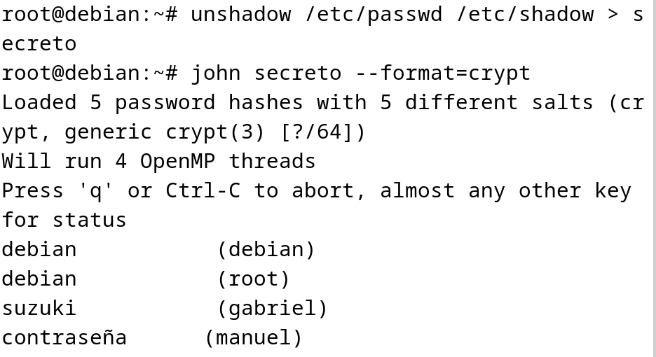
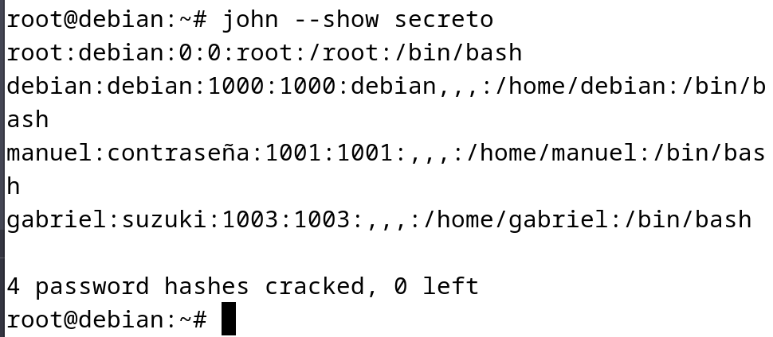
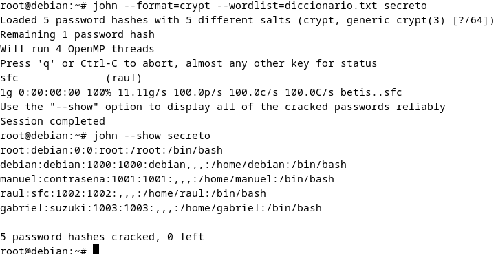
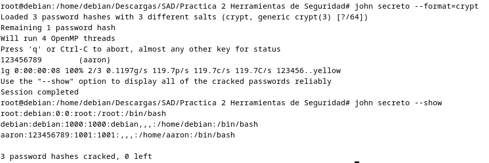
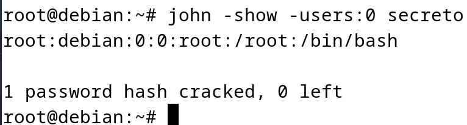
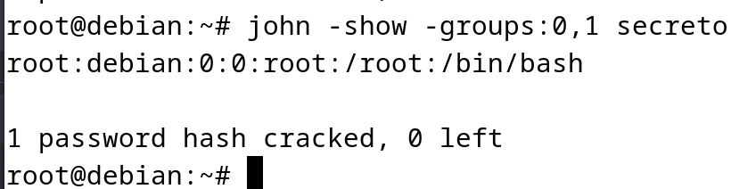

## Crackeo de GNU/Linux (Cuentas de usuario)

**Para este escenario en modo local voy a descifrar las contraseñas del equipo Debian (de ejemplo), donde he creado unos usuarios:**

- debian: debian
- root: debian
- gabriel: suzuki
- manuel: contraseña
- raul: sfc 

John The Ripper utiliza en este modo un parámetro llamado `--format=crypt` que es utilizado cuando se trabaja con archivos de contraseñas que contienen tanto la información de la contraseña en claro como el hash (como en los archivos "passwd" y "shadow"), este parámetro te permite indicar que el formato del hash es "crypt"(solo pass users con `$y$`).

El formato `crypt` se refiere a un método de cifrado de contraseñas utilizado en sistemas basados en UNIX. Este método toma la contraseña en claro y la hashea utilizando una función de resumen de contraseñas, generalmente basada en el algoritmo DES (Data Encryption Standard).

Para comenzar he utilizado el comando `unshadow` que es utilizado para combinar la información de un archivo `passwd` (que contiene detalles de usuarios, incluyendo nombres de usuario y contraseñas encriptadas) y un archivo `shadow` (que generalmente almacena contraseñas encriptadas y otras configuraciones de seguridad).

``` bash
sudo unshadow /etc/passwd /etc/shadow > secreto
```


Ahora, con el archivo ya combinado resultante "secreto" ya esta listo para usar John mediante el siguiente comando:

``` bash
sudo john secreto --format=crypt
```




Y como se ve en la imagen ha conseguido descifrar la contraseña de los 4 primeros usuarios antes mencionados. Pero el usuario raul no lo ha conseguido asi que más abajo lo hare con un diccionario.



Como el usuario `raul` aún sigue sin crackear, usaré un ataque con un diccionario simple creado por mi con palabras de ejemplo. Tan sencillo como hacer un `nano diccionario.txt` e ir escribiendo palabras. Con el diccionario creado para usarlo en este caso es:

``` bash
john --format=crypt --wordlist=diccionario.txt secreto
```





Con esta forma si se ha crackeado esa contraseña también a nivel de ejemplo, usando un pequeño diccionario. También aclaro que este ejemplo sirve porque he introducido la contraseña entre las palabras del diccionario para suponer el uso de uno grande como `rockyou`, pero sin tener que estar esperando tanto tiempo.

Otro ejemplo es teniendo al usuario `aaron:123456789` con el modo crypt también funciona siendo sólo digitos sin especificar otros parámetros:




**Para ver los root comprometidos:**

``` bash
sudo john -show -users:0 secreto
```




**Para ver cuentas de grupo privilegiados:**

``` bash
sudo john -show -groups:0,1 secreto
``` 




 ls /usr/share/wordlists lista diccionarios.


crunch 4 4 -t ,%@% -o diccionario.txt diccionario de 4 


# Paso 1: Combinar los archivos /etc/passwd y /etc/shadow usando unshadow
sudo unshadow /etc/passwd /etc/shadow > secreto.txt

# Paso 2: Usar John the Ripper para descifrar las contraseñas con el diccionario proporcionado
# (asegúrate de que el archivo de diccionario esté en el mismo directorio o especifica la ruta completa)
john --format=crypt --wordlist=dicc.txt secreto.txt

# Paso 3: Ver el resultado de las contraseñas descifradas
john --show secreto.txt

