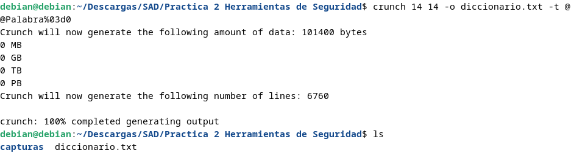
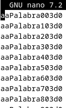
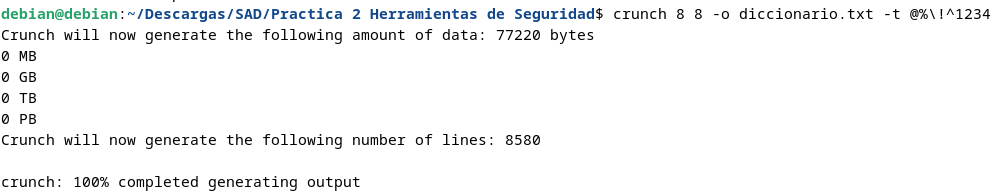
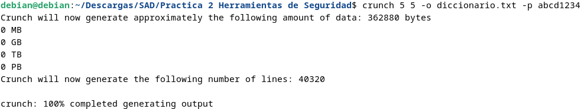
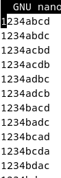

# Generación de diccionarios siguiendo reglas:


## Crunch

Crunch es una herramienta que nos permite generar palabras para un diccionario basándose en los parámetros que le especifiquemos. Genera listas de palabras basadas en patrones y reglas específicas para la creación de diccionarios
que luego se utilizarán en diversos ataques de diccionario. En pocas palabras, genera diccionarios personalizados siguiendo las reglas que se le ordene.

### Instalación:
```bash
apt install crunch
```

En el uso de crunch se necesitan al menos 3 parámetros:

```bash
crunch 2 7 -o /tmp/diccionario.lst
```

- Primer parámetro: cantidad mínima de caracteres.
- Segundo parámetro: cantidad máxima de caracteres.
- -o: Donde se guardara la salida del comando.

## Ejemplos de uso:

### **Diccionario de 14 caracteres que incluye letras mayúsculas, la palabra `Palabra`, números de tres dígitos y el carácter '0'.**

``` bash
crunch 14 14 -o diccionario.txt -t @@Palabra%03d0
```








- `-t @@Palabra%03d0:` Aquí, @@ se reemplazará por letras en mayúsculas, Palabra permanecerá como está, %03d generará números de tres dígitos y 0 al final será constante.


### **Diccionario con palabras de 8 caracteres que consisten en `letras minúsculas, números y los caracteres especiales !, %, ^, 1, 2, 3, y 4.`**

```bash
crunch 8 8 -o diccionario.txt -t @%\!^1234
``` 




**Diccionario con palabras de 5 caracteres combinando las letras a, b, c, d, y los números 1, 2, 3, 4.**

```bash
crunch 5 5 -o diccionario.txt -p abcd1234
```







# Por otro lado: Reglas de Diccionarios de John:

Sintaxis de Reglas de Wordlist para John the Ripper

Las reglas de wordlist se utilizan para generar wordlists personalizadas basadas en patrones y transformaciones especificadas. Las reglas consisten en banderas de rechazo, constantes y variables numéricas, clases de caracteres, comandos simples, comandos de cadena, comandos de control de longitud, comandos de gramática inglesa, comandos de inserción/eliminación, comandos de conversión de conjunto de caracteres, comandos de acceso a memoria, comandos numéricos, comandos de clases de caracteres y comandos adicionales para el modo "single crack".

## Banderas de Rechazo de Reglas:

    -: No realiza ninguna acción; sin rechazo.
    -c: Rechaza a menos que el tipo de hash actual sea sensible a mayúsculas y minúsculas.
    -8: Rechaza a menos que el tipo de hash actual utilice caracteres de 8 bits.
    -s: Rechaza a menos que algunas contraseñas hayan sido divididas al cargar.
    -p: Rechaza a menos que los comandos de pares de palabras estén permitidos actualmente.

## Constantes y Variables Numéricas:

    0...9: Representando de 0 a 9.
    A...Z: Representando de 10 a 35.
    *: Para max_length (longitud máxima).
    -: Para (max_length - 1).
    +: Para (max_length + 1).
    a...k: Variables numéricas definidas por el usuario.
    l: Longitud inicial o actual de la palabra.
    m: Posición inicial o recordada del último carácter de la palabra.
    p: Posición del último carácter encontrado con los comandos "/" o "%".
    z: Posición o longitud "infinita" (más allá del final de la palabra).

## Clases de Caracteres:

    ??: Coincide con "?".
    ?v: Coincide con vocales: "aeiouAEIOU".
    ?c: Coincide con consonantes: "bcdfghjklmnpqrstvwxyzBCDFGHJKLMNPQRSTVWXYZ".
    ?w: Coincide con espacios en blanco: espacio y tabulación horizontal.
    ?p: Coincide con puntuación: ".,:;'?!`" y comillas dobles.
    ?s: Coincide con símbolos "$%^&*()-_+=|<>[]{}#@/~".
    ?l: Coincide con letras minúsculas [a-z].
    ?u: Coincide con letras mayúsculas [A-Z].
    ?d: Coincide con dígitos [0-9].
    ?a: Coincide con letras [a-zA-Z].
    ?x: Coincide con letras y dígitos [a-zA-Z0-9].
    ?z: Coincide con todos los caracteres.

## Comandos Simples:

    : (dos puntos): No realiza ninguna acción (no-op).
    l: Convertir a minúsculas.
    u: Convertir a mayúsculas.
    c: Capitalizar.
    C: Minúsculas para el primer carácter y mayúsculas para el resto.
    t: Cambiar mayúsculas y minúsculas en toda la palabra.
    TN: Cambiar mayúsculas y minúsculas del carácter en posición N.
    r: Invertir la palabra.
    d: Duplicar la palabra.
    f: Reflejar la palabra.
    {: Rotar la palabra a la izquierda.
    }: Rotar la palabra a la derecha.
    $X: Agregar el carácter X a la palabra.
    ^X: Prefijar la palabra con el carácter X.

## Comandos de Control de Longitud:

    <N: Rechazar la palabra a menos que tenga menos de N caracteres.
    >N: Rechazar la palabra a menos que tenga más de N caracteres.
    'N: Truncar la palabra a una longitud de N.

## Ejemplos de usos varios:

**Ejemplo 1: Aplicar una Regla a un Wordlist Existente:**

Por ejemplo, con un wordlist llamado passwords.txt y quiero aplicar la regla de duplicar cada palabra.

`john --wordlist=passwords.txt --rules=:d`

**Ejemplo 2: Crear un Wordlist con Transformaciones:**

Por ejemplo, generar un wordlist que contenga todas las combinaciones de una palabra en minúsculas, 
mayúsculas y con un dígito al final.

`john --wordlist=wordlistviejo.txt --rules=:l$[0-9]`

**Ejemplo 3: Fuerza Bruta con Variaciones de Longitud:**

Por ejemplo, probar todas las combinaciones de una palabra con longitudes diferentes.

`john --incremental=Digits`

**Ejemplo 4: Integración de un Filtro Externo:**

Por ejemplo, para añadirle al ataque archivo llamado filtro.txt con palabras específicas.

`john --wordlist=passwords.txt --external=filtro.txt`
