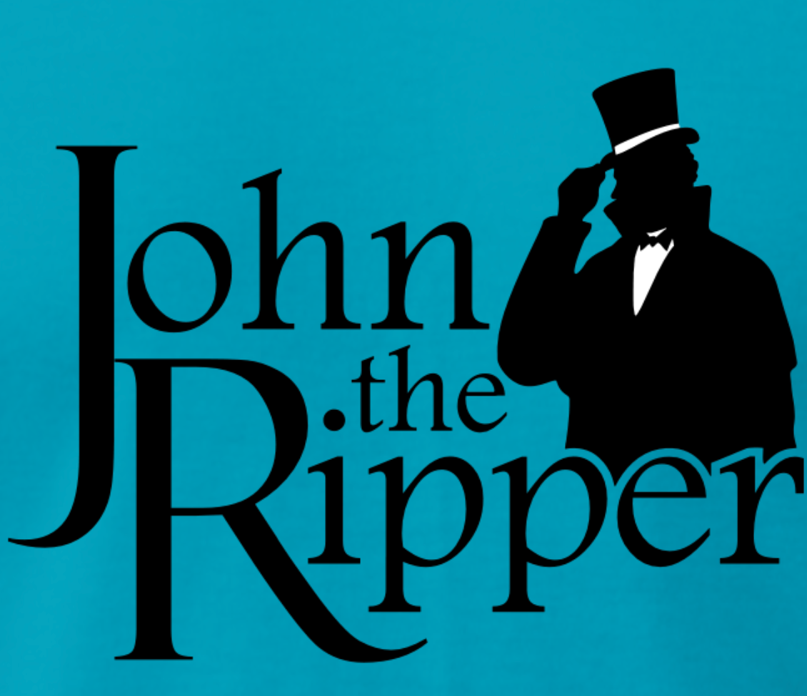
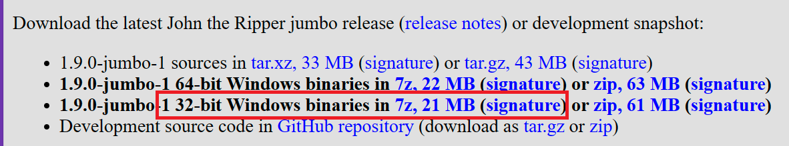
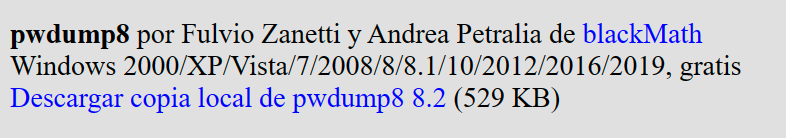
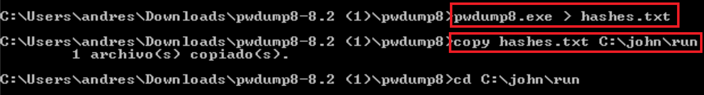
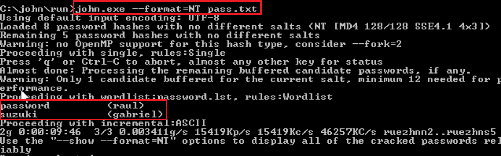
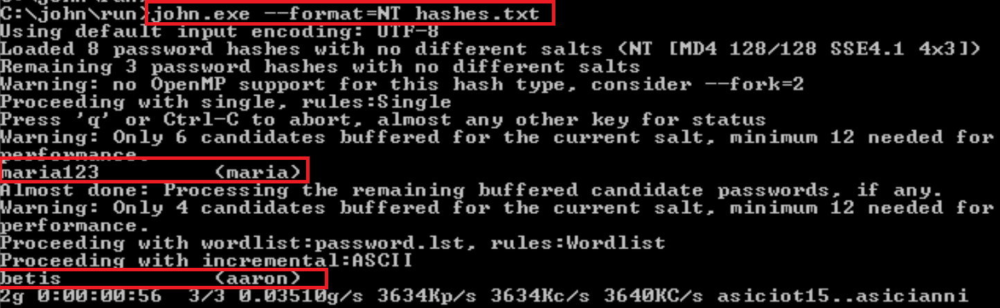
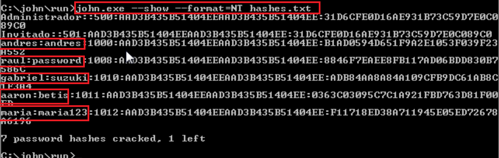

# John The Ripper para Sistemas Windows:




El NT Hash o NTLM (New Technology Lan Manager) que hace referencia a la versión anterior ("LM") del formato que Windows utilizaba. A partir de sistemas Windows 2008/Vista se usa por defecto NTLM (aunque por compatibilidad se puede seguir haciendo uso de LM).

En sistemas Windows actuales, las contraseñas suelen almacenarse de forma segura en un archivo llamado SAM (Security Account Manager). 
Este archivo está ubicado en la ruta `C:\Windows\System32\config\SAM`. Sin embargo, este archivo está protegido y no puede ser copiado o accedido directamente mientras Windows está en ejecución.

Para obtener las contraseñas almacenadas en el archivo SAM, se utilizan herramientas externas como `pwdump` o `fgdump`. 
Estas herramientas aprovechan vulnerabilidades conocidas o debilidades en la seguridad del sistema para extraer la información de contraseñas.

## **pwdump:**

Herramienta que se utiliza para extraer las contraseñas almacenadas en el archivo SAM. Hay que descargar `pwdump` y ejecutarlo desde la línea de comandos.

## **fgdump:**

Herramienta similar a pwdump que también se utiliza para extraer contraseñas del archivo SAM.

## Extrayendo manualmente del archivo SAM: Accede al archivo SAM:

El archivo SAM está en `%SystemRoot%\system32\config\SAM`, aunque lo ideal es copiarlo a otro lugar para trabajar con él.


## Comprobar contraseñas:

Para comprobar el nivel de seguridad nuestras contraseñas, se puede ver en la siguiente web:

https://passwordmeter.com/

# Preparación del escenario:

Para este escenario he descargado la versión `Jumbo` de 32bits. https://www.openwall.com/john/



Por otro lado la herramienta pwdump desde https://www.openwall.com/passwords/windows-pwdump



Para esta parte he elegido un Windows 7 pro. Por otro lado he creado los usuarios:
- raul:password
- gabriel:suzuki
- maria:maria123
- aaron:betis

Con el sistema preparado, hay que crear una carpeta en C:, en mi caso la he llamado john. En esta carpeta hay que descomprimir los archivos de John the Ripper Jumbo. 

Ahora con la herramienta pwdump, hay que hacer un volcado de la siguiente manera:

``` bash
pwdump8.exe > hashes.txt
``` 


Y ahora el archivo `pass.txt` lo he copiado a la carpeta `john\run\`.

Ahora con todo preparado es el momento de usar `john` de manera incremental y para ello:

``` bash
john.exe --format=NT pass.txt
```





Nota: Para estas pruebas primero probe con un archivo llamado `pass.txt` y posteriormente añadiendo un par de usuarios mas `hashes.txt` por si el nombre del archivo no coincide en las imágenes.

Para ver las contraseñas en texto claro he usado el comando:
```bash
john --show --format=NT hashes.txt
```



## Con diccionarios:

Para este escenario con diccionario, he usado el diccionario rockyou pero también es posible crearlo a mano de la misma forma que en el apartado de linux (creando un archivo de texto):

Con el diccionario creado, la forma de utilizarlo es:

```bash
john --wordlist=rockyou.txt --format=NT hashes.txt
```


Como se puede observar en las imágenes el uso de John The Ripper en Windows es similar al uso en linux, solo que cambia la ubicación del archivo de contraseñas y del tipo de hash utilizado. 


