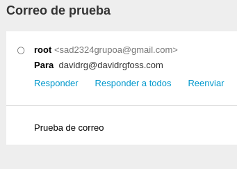
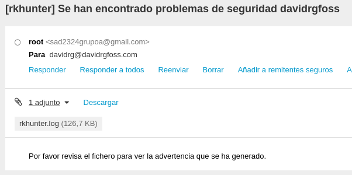

## Avisos por correo

Una de las cosas más importantes para un administrador, es recibir avisos de emergencias o problemas, ya que no estará todo el rato mirando un log o máquina. En este caso `rkhunter` tiene opción de configurar avisos por correo de forma bastante sencilla como vamos a ver a continuación. Pero antes vamos a configurar un servidor de correo para que pueda enviar email.

### Postfix y mutt

En mi caso he escogido el servidor de correos `postfix` y el cliente de correos `mutt`. Aunque el servidor suele instalar las dependencias del cliente `mail`, este no es del todo compatible con el envío de ficheros por lo que es incompatible con mi idea de enviar un fichero `log` junto al aviso.

Primero debemos instalar los paquetes necesarios que son:
```bash
apt install postfix mutt libsasl2-modules ca-certificates
```

Durante la instalación de `postfix` escogeremos la opción "**sitio de internet**", esto generará un fichero de configuración que usaré como base para modificar luego.
Luego modificaremos el fichero generado `/etc/postfix/main.cf` añadiendo lo siguiente:

```plaintext
relayhost = [smtp.gmail.com]:587 # Este parámetro lo modificamos porque ya está en el fichero.
smtp_use_tls = yes
smtp_sasl_auth_enable = yes
smtp_sasl_security_options = noanonymous
smtp_sasl_password_maps = hash:/etc/postfix/sasl_passwd
```

En la configuración anterior estamos especificando que se use el servidor `smtp` de Google para que se encargue de hacer el envío de nuestros correos. Esto es algo a preferencia de cada persona, pues se pueden usar otros servidores diferentes.

Lo siguiente será generar una base de datos con el usuario y contraseña que usaremos para autenticarnos en el servidor `smtp`. En este caso sería el correo de **Gmail** y la contraseña de dicho correo, aunque dejar nuestra contraseña escrita en un fichero no es algo que podamos considerar muy seguro. Si no queremos usar la contraseña podemos usar un `token` de aplicación que permita la autenticación en el servidor `smtp` sin escribir directamente nuestra contraseña. Este `token` se puede generar en el apartado de seguridad de nuestra cuenta de **Gmail**.

Ahora creamos el fichero `/etc/postfix/sasl_passwd`, en mi caso con el contenido:

```plaintext
[smtp.gmail.com]:587 sad2324grupoA@gmail.com:password
```

Generamos el fichero `sasl_passwd.db` con el comando:

```bash
postmap /etc/postfix/sasl_passwd
systemctl restart postfix # Reiniciamos el servicio
```

Por último, si queremos ya podemos probar a enviar un correo electrónico como prueba de la siguiente forma:

```bash
echo "Prueba de correo" | mutt -s "Correo de prueba" davidrg@davidrgfoss.com
```

* Prueba de uso.

    

### Configurar avisos en rkhunter

Después de haber configurado la posibilidad de enviar correos, debemos modificar dos parámetros del fichero `/etc/rkhunter.conf`. Al modificarlo permitirá que la herramienta nos envíe avisos de forma automática en caso de detectar algún fallo, en mi caso yo pondré mi correo. Los parámetros a modificar son los siguientes:

```plaintext
MAIL-ON-WARNING=davidrg@davidrgfoss.com
MAIL_CMD=mutt -s "[rkhunter] Se han encontrado problemas de seguridad ${HOST_NAME}" -a /var/log/rkhunter.log -- davidrg@davidrgfoss.com < /etc/postfix/mensaje.txt
```
Como expliqué anteriormente para guardar la nueva configuración aunque no es obligatorio sí es recomendable ejecutar `rkhunter -C`

Esta configuración hará que se me envíe a mi correo, un mensaje con el asunto "Se han encontrado problemas de seguridad" con el nombre de la máquina y el cuerpo de mensaje será un texto guardado en el fichero `/etc/postfix/mensaje.txt`. A este envío se le añadirá el `log` generado por el escaneo para que podamos revisar desde cualquier lugar el problema detectado.

Como podemos ver es un proceso sencillo, aunque esta herramienta tiene opciones muy extensas. Ahora vamos a probar la configuración para que podamos ver que está todo correcto. Para ello ejecutamos el siguiente comando:

```bash
rkhunter -c --sk
```

Podemos ver las opciones de ejecución con `rkhunter --help`, al ser pocas y sencillas de entender no he visto necesario detallarlas. En este caso la "-c" está indicando que quiero un escaneo en la máquina y la opción "--sk" que se confirme cada tramo del escaneo para no tener que estar pulsando siguiente.


* Aquí podemos ver que ha llegado el mail con el aviso y el log adjunto.
