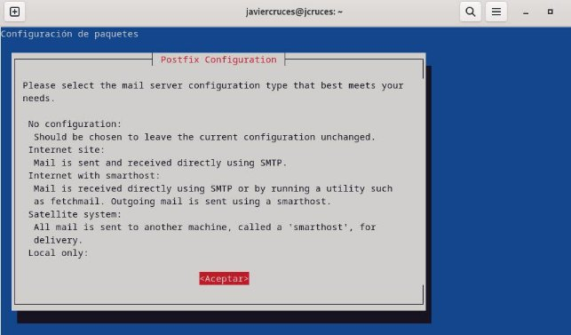
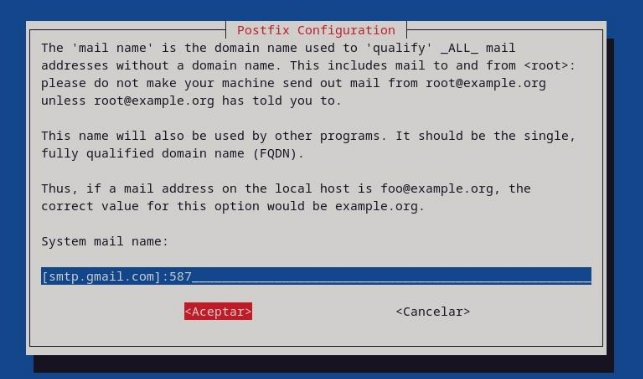

# Configuración de mail

Para hacer que las alertas las podamos mandar por email es necesario que le indiquemos a snort que lea el syslog , para ello utilizaremos el parámetro -s . Por defecto esto viene desactivado así que  en el archivo de configuración , tenemos que descomentar la siguiente linea en el fichero de configuración de snort /etc/snort/snort.conf :

Con esto estamos indicando que las alertas se guarden en el fichero /var/log/auth.log .

Ahora vamos a instalarnos postfix y mailutils , un servidor de correo electrónico que nos permitirá mandarnos alertas a una dirección de correo electrónico :

Nos preguntara que donde esta nuestro servidor de correo electrónico y nos dará una breve explicación de cada opción :

En mi caso usare mi correo de Google así que para ello utilizaremos sitio de internet :

Y ponemos el servidor smtp de Google :

Ahora vamos a ir a fichero de configuración  /etc/postfix/main.cf    y vamos a añadir las siguientes lineas , esto es la configuración del servidor de  correo Google que necesitamos para enviar correos. Recuerda que tienes que borrar casi al final del fichero una linea vacía relayhost = ya que nos dará conflicto con la que vamos a añadir al final .

Después nos vamos a  crear el fichero /etc/postfix/sasl\_passwd y añadimos el servidor SMTP de Gmail en mi caso, el puerto por la que escucha, nuestro correo y la contraseña: :

\*La contraseña que hemos introducido aquí hemos tenido que generarla dentro de nuestra cuenta de Google como contraseña de aplicación ya que al tener activada la verificación en dos pasos ciertas aplicaciones que no cuentan con los últimos estándares  de seguridad Google no las deja acceder a sus servidores , así que para permitirle acceder a los mismos deberemos de crear una . Te dejo un tutorial por si no sabes generarla .

Para evitar que otro usuario pueda leer la contraseña al estar en texto claro y que pueda utilizar de forma indebida nuestro mail vamos a editar los permisos del fichero :

Una vez hecho esto vamos a sacar el hash de la contraseña para que sea mas seguro guardar la contraseña en texto claro , para ello utilizamos postmap y a continuación reiniciamos el servicio :

Ahora se nos habrá creado un nuevo archivo el cual contiene la información de inicio de sesión de nuestro servidor de correo /etc/postfix/sasl\_passwd.db .

Por ultimo mandaremos un correo de prueba usando la herramienta mail : 

Y comprobaremos que nos ha llegado : 

Una vez configurado el servidor de correo tendremos que hacer uso de la herramienta swacht , esta se encargara de leer los logs y cuando este cumpla una condición nos mandara un correo . Lo primero que haremos sera instalarlo :

A continuación dentro del fichero de configuraron /etc/swatchrc , vamos a escribir el patrón que las alertas tienen que cumplir para que nos llegue un correo electrónico, por ejemplo que solo nos envié las alertar de prioridad 2 :

Ahora vamos a decirle que se ejecute como demonio para que este funcionando en segundo plano y le diremos que archivo log tiene que leer que para snort es /var/log/auth.log :

Una vez configurado el servidor de correo y swacht vamos a ejecutar snort para que nos envié las alertas por correo , recuerda que tienes que ejecutarlo con el parámetro -s :

Ahora si usamos un nmap y lo lanzamos a nuestra red veremos que nos avisara por consola y además nos mandara un correo :

Podemos observar que nos lo reporta por consola :

Y que además nos llega por correo :

