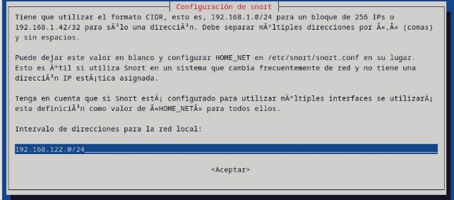

# Instalación

Podemos hacer la Instalación mediante los paquetes oficiales de nuestra distribución GNU/Linux. En mi caso estoy usando Debian 12 . La posición en el esquema de red que ocupe snort es muy importante , el fabricante recomienda ponerlo detrás del Firewall .

Lo primero que haremos sera actualizar nuestros repositorios y a continuación comenzaremos a descargarnos las dependencias de snort :

- **gcc:** El compilador de GNU C/C++, esencial para compilar código fuente C y C++.
- **libpcre3-dev:** Biblioteca de expresiones regulares de Perl (PCRE) que se utiliza para el análisis y procesamiento de patrones de texto.
- **zlib1g-dev:** Biblioteca de compresión zlib que permite comprimir y descomprimir datos. Se utiliza en aplicaciones que requieren compresión de datos.
- **libluajit-5.1-dev:** Biblioteca de LuaJIT, que proporciona una implementación Just-In-Time (JIT) de Lua, un lenguaje de scripting.
- **libpcap-dev:** Biblioteca utilizada para capturar y procesar tráfico de red en tiempo real. Es esencial para Snort, ya que le permite analizar paquetes de red.
- **openssl:** Herramienta y biblioteca de seguridad que proporciona protocolos seguros de comunicación a través de Internet, como SSL/TLS.
- **libssl-dev:** Desarrollo de bibliotecas SSL/TLS, que permite a las aplicaciones utilizar seguridad de capa de transporte.
- **libnghttp2-dev:** Biblioteca de HTTP/2 de alto rendimiento y bajo nivel que permite conexiones HTTP más eficientes.
- **libdumbnet-dev:** Biblioteca para el acceso a la pila de protocolos de red de bajo nivel. Se utiliza para la captura y manipulación de tráfico de red.
- **bison:** Generador de analizadores sintácticos que se utiliza para generar código fuente para analizar lenguajes formales.
- **flex:** Generador de analizadores léxicos que se utiliza para generar código fuente para analizar texto en un formato específico.
- **libdnet:** Biblioteca de bajo nivel para la manipulación de datos de red. Proporciona funciones de bajo nivel para interactuar con dispositivos de red y protocolos.
- **autoconf:** Herramienta de configuración automática que se utiliza para generar scripts de configuración para software en desarrollo.
- **libtool:** Herramienta utilizada para gestionar la creación de bibliotecas compartidas en diferentes sistemas operativos.

Una vez hecho esto nos descargaremos el paquete snort :

**\*** Actualmente snort no tiene soporte oficial para debian 12 así que tendremos que usar  los repositorios de debian 11 , es tan fácil como añadir el repositorio de la versión anterior . Recuerda actualizar los repositorios cuando la añadas haciendo un apt update.

Cuando instalemos el paquete , nos saltara una ventana en la cual nos pedirá en que rango de red queremos  que  snort  trabaje  .  Podemos  cambiar  este  valor  posteriormente  en  el  fichero /etc/snort/snort.conf .

Una  vez  introducido  seguirá  la  instalación  por  defecto  del  producto  ,  cuando  finalice comprobaremos la versión que tenemos instalada :

