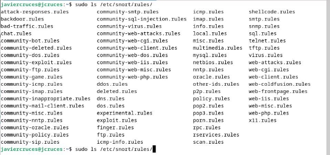
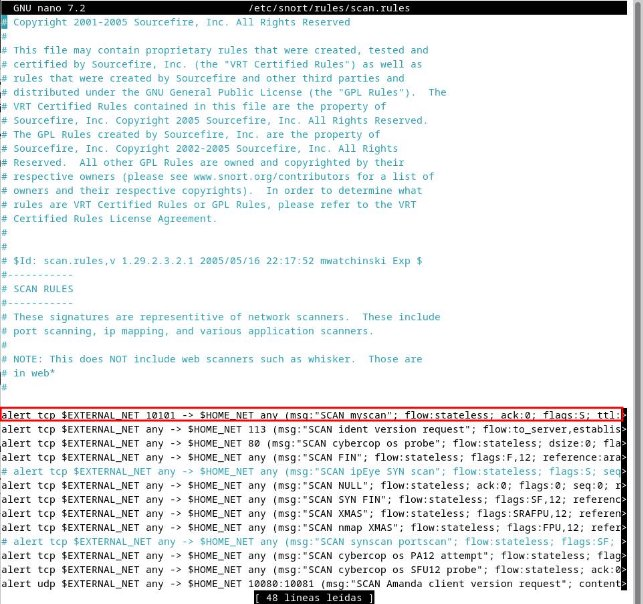
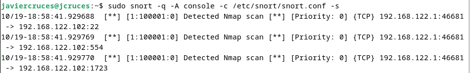
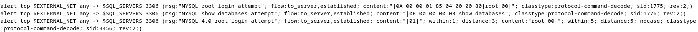

# Introducción a las reglas

Las reglas son los patrones que se buscan dentro de la red en los paquetes . Estas son utilizadas por el motor de detección para comparar los paquetes recibidos y generar las alertas en caso de coincidencia con el contenido de los paquetes y firmas .

Podemos dividir las reglas en cuatro categorías para evaluar el paquete , estas a su vez se dividen en dos subgrupos las que tienen contenido y las que no :

- **Protocolo** : Son las que son dependientes del protocolo que se esta analizado , por ejemplo en el protocolo http se encuentra la palabra reservada uricontent
- **Genéricas** : Permiten especificar patrones para buscar en el campo de datos del paquete , los patrones de búsqueda pueden ser binarios o en modo ASCII
- **Paquetes malformados:**  Especifican características sobre los paquetes , concretamente sobre sus cabeceras las cuales indican que se están produciendo algún tipo de anomalía , este tipo de reglas no miran el contenido ya que primero se comprueban las cabeceras en busca de incoherencias o de alguna anomalía
- **Reglas IP:** Se aplican directamente sobre la capa IP y son comprobadas por cada datagrama IP , si el datagrama luego es TCP , UDP o ICMP se realizara un análisis del datagrama con su correspondiente capa de protocolo , este tipo de reglas se analizan con contenido y sin el .

Además , Snort nos permite crear nuevas reglas , modificando las propias reglas existentes , lo cual nos permite crear nuevas reglas avanzadas en función de los servicios que queramos monitorizar y proteger en nuestra red .

## Reglas  por defecto

Una vez instalado Snort procederemos a ver un poco de la configuración con la que cuenta. Snort cuenta con 73 reglas (correspondientes a nuestra versión) preconfiguradas durante el proceso de instalación, las cuales se encuentran el directorio /etc/snort/rules/ :

- attack-responses.rules - Reglas para detectar respuestas a ataques.
- backdoor.rules - Reglas para detectar tráfico asociado a puertas traseras.
- bad-traffic.rules - Reglas para detectar tráfico malicioso o anómalo.
- chat.rules - Reglas para detectar tráfico de chat.
- ddos.rules - Reglas para detectar ataques de denegación de servicio (DDoS).
- deleted.rules - Reglas que se han eliminado y no se utilizan.
- dns.rules - Reglas para detectar tráfico DNS malicioso.
- dos.rules - Reglas para detectar ataques de denegación de servicio (DoS).
- experimental.rules - Reglas experimentales para detección de ataques.
- exploit.rules - Reglas para detectar intentos de explotación de vulnerabilidades.
- finger.rules - Reglas para detectar tráfico del servicio Finger.
- ftp.rules - Reglas para detectar tráfico FTP malicioso.
- icmp-info.rules - Reglas para detectar tráfico ICMP informativo.
- icmp.rules - Reglas para detectar tráfico ICMP.
- imap.rules - Reglas para detectar tráfico IMAP.
- info.rules - Reglas informativas.
- local.rules - Reglas locales específicas del entorno.
- misc.rules - Reglas varias para detectar tráfico anómalo.
- multimedia.rules - Reglas para detectar tráfico multimedia malicioso.
- mysql.rules - Reglas para detectar tráfico MySQL malicioso.
- netbios.rules - Reglas para detectar tráfico NetBIOS malicioso.
- nntp.rules - Reglas para detectar tráfico NNTP.
- oracle.rules - Reglas para detectar tráfico Oracle malicioso.
- other-ids.rules - Otras reglas de detección de intrusiones.
- p2p.rules - Reglas para detectar tráfico de redes P2P.
- policy.rules - Reglas relacionadas con políticas de seguridad.
- pop2.rules - Reglas para detectar tráfico POP2.
- pop3.rules - Reglas para detectar tráfico POP3.
- porn.rules - Reglas para detectar contenido para adultos.
- rpc.rules - Reglas para detectar tráfico RPC malicioso.
- rservices.rules - Reglas para detectar servicios de red.
- scan.rules - Reglas para detectar escaneo de puertos y servicios.
- shellcode.rules - Reglas para detectar shellcode malicioso.
- smtp.rules - Reglas para detectar tráfico SMTP malicioso.
- snmp.rules - Reglas para detectar tráfico SNMP malicioso.
- sql.rules - Reglas para detectar ataques de inyección SQL.
- telnet.rules - Reglas para detectar tráfico Telnet malicioso.
- tftp.rules - Reglas para detectar tráfico TFTP.
- virus.rules - Reglas para detectar tráfico relacionado con virus.
- web-attacks.rules - Reglas para detectar ataques web.
- web-cgi.rules - Reglas para detectar ataques a aplicaciones web CGI.
- web-client.rules - Reglas para detectar tráfico de clientes web maliciosos.
- web-coldfusion.rules - Reglas para detectar ataques a aplicaciones web ColdFusion.
- web-frontpage.rules - Reglas para detectar ataques a aplicaciones web FrontPage.
- web-iis.rules - Reglas para detectar ataques a servidores web IIS.
- web-misc.rules - Reglas varias para detectar ataques web.
- web-php.rules - Reglas para detectar ataques a aplicaciones web PHP.
- x11.rules - Reglas para detectar tráfico X11.

SNORT puede implementar cualquier tipo de regla, las reglas de SNORT no están incluidas con el software. Sin embargo, existen diferentes fuentes para encontrar e implementar reglas:

- Equipo de Investigación de Vulnerabilidad (VRT) : Estas son las reglas de Snort “oficiales”. Son proporcionados por Sourcefire y son actualizados semanalmente por Sourcefire VRT.
- Emerging Threats (ET) : Las reglas de amenazas emergentes son un proyecto comunitario de código abierto. Este conjunto es el conjunto de reglas de Snort más diverso y de movimiento más rápido. Las reglas se actualizan varias veces al día.
- Reglas de la comunidad : Estas reglas son creadas por la comunidad de SNORT. Hay muy pocas reglas y la última versión es de 2007 para Snort 2.4. La mayoría de las amenazas que detectan ya están implementadas en ET o VRT.

- Reglas caseras y otras : Son las reglas, creadas y mantenidas localmente, según las necesidades específicas de la red. También pueden existir otras reglas. Para amenazas específicas y otras amenazas “únicas”, los motores de búsqueda pueden proporcionar reglas más específicas, pero es necesario saber qué buscar. 

Una regla de SNORT puede definirse mediante muchos parámetros. Una regla se compone de dos partes distintas: El encabezado de la regla y las opciones de la regla.

El encabezado de la regla contiene la acción de las mismas, el protocolo, las direcciones IP de origen y destino y las máscaras de red, y la información de los puertos de origen y destino. La sección de opciones de reglas contiene mensajes de alerta e información sobre qué partes del paquete deben inspeccionarse para determinar si se debe tomar la acción de la regla. Un ejemplo :

alert tcp any any -> 10.0.0.0/24 80 \ (content:"|00 00 00 00|"; depth: 8; \ msg:"Error de bytes nulos"; sid:9876)

Esta regla activará una alerta si se encuentran cuatro bytes nulos en los primeros ocho bytes de todo el tráfico enviado al puerto 80 a la red 10.0.0.0/24. El ID único de la regla es 9876 y el mensaje de alerta es "Error de bytes nulos". Las reglas son poderosas y hay muchas posibilidades: es posible buscar bytes en una posición específica, dentro del rango de otros bytes, o contar el número de ocurrencias de una coincidencia antes de una alertar. También es posible utilizar Expresiones regulares compatibles con Perl (PCRE) en los datos y limitar la búsqueda a bytes específicos.

Para que una regla active una alerta, todos los elementos contenidos en las opciones de la regla deben ser verdaderos. Estos elementos se comprueban secuencialmente. Si el primero es falso, los demás no se comprobarán. Por tanto, el orden de los argumentos es muy importante para optimizar las reglas.

Podemos listar todos los ficheros de reglas que se almacenan en el directorio /etc/snort/rules/ , como puedes observar tienen un nombre descriptivo para tener organizadas las reglas en función de los distintos ataques , tal como te indico anteriormente :

## Reglas de reconocimiento

Podemos poner el escáner a funcionar simplemente con las reglas que trae , por ejemplo tienen una sección para alertar de  escáneres de puertos y escáneres de red para cualquier equipo de nuestra red . Estas reglas creadas por snort podemos encontrarlas en la ruta /etc/snort/rules/scan.rules
:

Podemos listar el contenido en las reglas :

Para hacer saltar , las alertas de este fichero ejecutamos **sudo nmap -sS 192.168.122.102** desde otra maquina y veremos que si ponemos el servidor a funcionar con las reglas por defecto nos saltara la alerta puesta en el mensaje :

## Reglas Mysql

También podemos detenernos a ver las reglas para mysql que trae snort , la puedes encontrar en la ruta **/etc/snort/rules/mysql.rules** . Esta nos avisara si hay un login con el usuario root a remotamente a la base de datos o si intentan listar las bases de datos entre otras .

Lo ideal siempre es que adaptemos las reglas que trae a nuestro escenario y que pongamos alertas personalizadas para tener un mayor control

