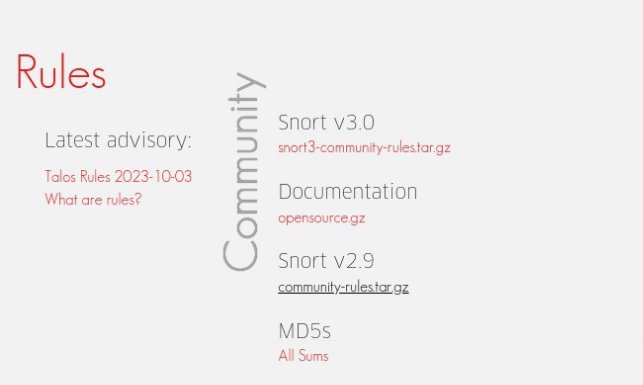
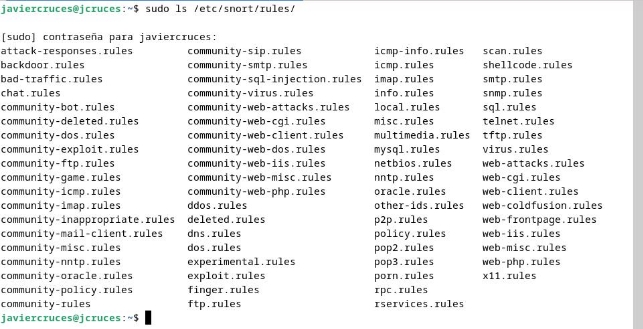
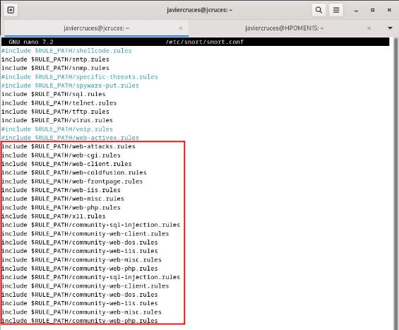
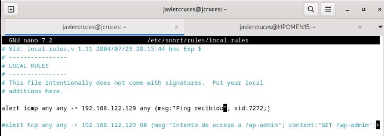
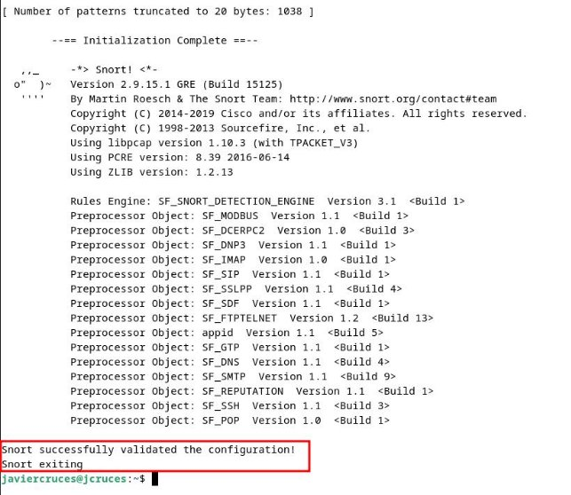
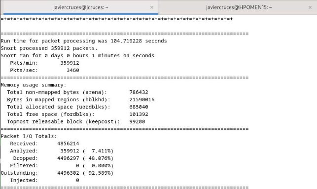

# Instalación reglas de la comunidad

La comunidad de snort han generado una serie de reglas por defecto para los ataques mas conocidos en la red , para que podamos añadirlas a nuestro snort :

Procedemos a desencargarlas en nuestra maquina :

Las descomprimimos y las guardamos en el directorio de las reglas /etc/snort/rules

Si listamos el directorio podremos ver que hay varias listas que comienzan por community , estas son las listas de la comunidad que acabamos de descomprimir :

Si queremos añadirlas a snort para que las utilice (por defecto viene activado) :

## Creación de reglas manuales

La sintaxis de las reglas de Snort sigue un formato específico que consta de varios campos y opciones .

action proto source\_ip source\_port -> dest\_ip dest\_port (options);id

- action: Este campo especifica la acción que debe tomar Snort cuando se cumple la regla. Las acciones comunes incluyen:
  - alert: Generar una alerta.
  - log: Registrar la actividad sin generar una alerta.
  - pass: Permitir el tráfico.
  - drop: Descartar el tráfico.
  - reject: Rechazar el tráfico.
- proto: Aquí se especifica el protocolo de red al que se aplica la regla, como tcp, udp, icmp, ip, entre otros.
- source\_ip: Indica la dirección IP de origen del tráfico que se está analizando. Puede ser una dirección IP específica o una red en notación CIDR (por ejemplo, 192.168.1.0/24).
- source\_port: Opcionalmente, puedes especificar el puerto de origen del tráfico. Esto permite limitar la regla a un puerto de origen específico.
- ->: Este operador indica la dirección de flujo del tráfico. -> se usa para el tráfico de origen a destino, mientras que <- se usa para el tráfico de destino a origen.
- dest\_ip: La dirección IP de destino del tráfico que se está analizando. Puede ser una dirección IP específica o una red en notación CIDR.
- dest\_port: Opcionalmente, puedes especificar el puerto de destino del tráfico. Esto permite limitar la regla a un puerto de destino específico
- options: Aquí es donde se definen las condiciones específicas o firmas que activarán la regla. Las opciones pueden incluir:

    - Firmas de contenido: Patrones de bytes o cadenas de texto a buscar en el tráfico.
    - Operadores: Indican cómo se debe evaluar la firma de contenido (por ejemplo, content, nocase, depth, etc.).
    - Otros criterios: Puedes agregar criterios adicionales, como direcciones IP, máscaras de red, direcciones URL o referencias a listas de IP.
    - Id: Numero identificativo de la regla . Los rangos de las oficiales van (1-1.000.000) , los de comunidad en adelante . Se recomienda evitar los rangos reservados o utilizar el rango de las comunitarias .

Un ejemplo de una regla puede ser , que tengamos un gestor de contenido como wordpress y queramos registrar cuando alguien acceder a la pagina de administración . La regla para registrar esto seria :

alert tcp any any -> 192.168.122.129 80 (msg:"Intento de acceso a /wp-admin"; content:"GET /wp- admin"; sid:1002;)

Las reglas que definimos nosotros tienen por defecto una ruta asignada , aunque si queremos podemos  agregarla  a  otro  archivo  o  declarar  uno  nuevo  .  La  ruta  por  defecto  es /etc/snort/rules/local.rules .

Otro ejemplo mas fácil de demostrar es avisar de cuando una maquina recibe un ping , en mi caso no quiero que el servidor web los reciba así que quiero que me avise de cuando esto ocurra , la regla seria la siguiente : 

Si ponemos a funcionar snort y le hacemos un ping nos reportara la alerta cuando reciba el ping el objetivo tal y como lo hemos configurado :

## Prueba de funcionamiento

Vamos a probar la herramienta con la configuración actual que tenemos haciendo un nmap desde mi host hacia la maquina donde esta alojado snort . Podemos haberlo hecho hacia cualquier otra maquina ya que tenemos configurado para que este en la red completa 192.168.122.0/24 .

Vamos a lanzar snort , pero primero comprobaremos si el fichero de configuración tiene algun error de sintaxis para ello lanzamos el siguiente comando :

Una vez snort revise la sintaxis nos informara si existe algún error , además nos da información adicional como versiones de paquetes , numero de reglas ...

La forma mas básica de iniciar snort es únicamente indicando la tarjeta de red , este se iniciara en modo dump  , cuando lo paremos este nos dará un resumen de los paquetes que ha analizado :

Cuando acabe la ejecución nos mostrara estadísticas sobre los paquetes que ha interceptado .

Nos lo desglosa además por protocolos :

Si queremos hacer un uso mas avanzado de la herramienta deberemos de utilizar una serie de parámetros que te explicare a continuación :

- -q (Quiet Mode): Sirve para ejecutar Snort en modo silencioso, lo que reduce la cantidad de información de salida en la consola.
- -c (Config File): Especifica el archivo de configuración de Snort, donde se definen las reglas, los preprocesadores y otros parámetros.
- -i (Interface): Indica la interfaz de red en la que Snort debe escuchar y analizar el tráfico.
- -r (Read Packet Capture File): Permite a Snort analizar un archivo de captura de paquetes en lugar de escuchar en una interfaz en tiempo real.
- -A (Alert Mode): Define el modo de generación de alertas. Puede ser console para que las muestre por consola , "fast" para generar alertas lo más rápido posible, "full" para una información más detallada o "none" para desactivar las alertas.
- -l (Log Directory): Especifica el directorio donde Snort almacenará los registros y las alertas.
- -o (Additional Options): Permite configurar opciones adicionales, como configuraciones de salida de registros específicas o habilitar/deshabilitar preprocesadores.
- -G (Dump GTP Protocol Data): Usado para depurar el protocolo GPRS Tunnelling Protocol (GTP).
- -K (Dump IPsec SA/ESP Packet Data): Usado para depurar el tráfico IPsec.
- -q (Suprime Salida Consola): Sirve para suprimir la salida en la consola, útil en modo silencioso.
- -s : Redirigira la salida de las alertas al traves de syslog y lo guardara  en la ruta /var/log/auth.log .

## Ataque flood

Por ejemplo si ejecutamos snort en modo consola , usando el archivo de configuración que hemos configurado y además en modo silencioso para omitir el inicio :

Y atacamos al servidor apache que tiene instalado nuestra maquina , haciendo un ataque de denegación de servicio con hping3:

Snort  leerá los ficheros de alerta y cuando un paquete cumpla esas condiciones nos lo reportara por la terminal :

Vemos que nos clasifica la alerta con un nombre , se le asigna la prioridad y nos muestra información de la red del paquete sospechoso .

