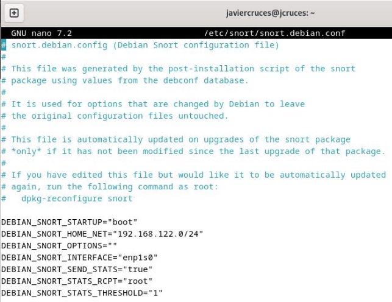

## Configuración

Durante la instalación, podemos configurar ciertos parámetros de Snort, aunque siempre se pueden cambiar  más  adelante  editando  el  fichero  de  configuración  específico  Debian /etc/snort/snort.debian.conf:

En este se configuran varios parámetros como que se inicie automáticamente al iniciar el sistema , la red en la que trabaja , las tarjetas de red que utiliza  que en este caso es según los parámetros que hemos indicado en la instalación del paquete .

Además, Snort dispone de otro fichero de configuración por defecto, donde se pueden modificar otras variables propias de la herramienta. Hay que tener en cuenta que la configuración del fichero Debian tiene prioridad sobre las variables de éste:

Algunos valores a tener en cuenta son: “ipvar HOME\_NET” el cual tendremos que cambiar a nuestro segmento de red (ej, 192.168.0.1/24). Y “ipvar EXTERNAL\_NET” que sería toda la red externa ajena a nuestra LAN, en este caso usaremos el valor “!$HOME\_NET”.

Podemos personalizar nuestra configuración mediante los siguientes apartados del fichero:

- Establecer las variables de red.
- Configuración del decodificador.
- Configuración del motor de detección.
- Configuración de carga dinámica de librerías
- Configuración de preprocesadores.
- Configuración de complementos de salida.
- Personalización de nuestro conjunto de reglas.
- Personalización del conjunto de reglas del procesador y el decodificador.
- Personalización del conjunto de reglas de objetos compartidos.

Todos los parámetros de snort se encuentran dentro de este fichero por ejemplo , tenemos una serie de variables para indicar sobre que puerto corren los servicios que queremos monitorizar y en que serie de ips se encuentran :

También podremos cambiar la ruta de los distintas reglas predefinidas o añadir nuevas rutas para tener nuestras propias reglas :

